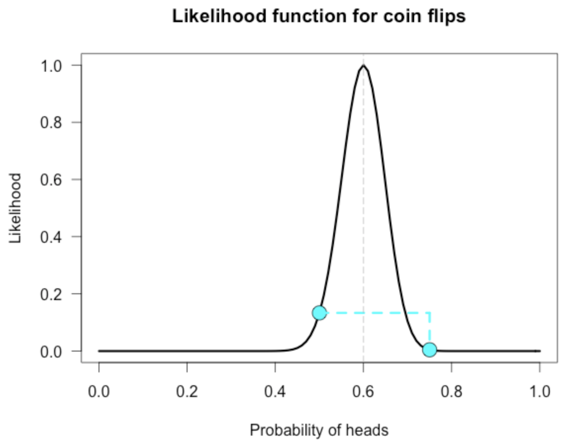

# 2024-12-22

## Math symbols

### Vector: $x=(x_1, x_2, ..., x_p)$

### Matrix

$X = \begin{pmatrix}
    x_{11} & x_{12} & ... & x_{1p}\\
    x_{21} & x_{22} & ... & x_{2p}\\
    ... \\
    x_{21} & x_{22} & ... & x_{2p}\\
\end{pmatrix}_{n \times p}$

### Function: f

- univariate: $f(x) \in \mathbb R$
- bivariate: $f(x_1, x_2, ..., x_p) \in \mathbb R$
- vector-valued: $f(x) \in \mathbb R$

### Linear Algebra

- positive definite matrix:

$$\begin{equation}
  D_{it} =
    \begin{cases}
      A_{n \times n} ~is~definitely~positive~if~x^TAx > 0 \\
      \forall vector x \not= 0 \\
      A ~is~definitely~positive~if~ |A| \\
    \end{cases}
\end{equation}$$
    $$A_{3 \times 3} -> |A_n| -> |a_11| \\
                      |A_2| -> \begin{vmatrix}
a_{11} & a_{12}\\
a_{21} & a_{22}\\
                       \end{vmatrix} \\
                      |A_3|$$
  - $A_{n \times n}$ is positive then there exists $A^{-1}$

### Function and Derivatives
### Derivatives - Gradient

Given $f(x)$ on $R^p ->R$ with x -> (x_1, x_2, ...,x_p )
    - Gradient of f is
    - $f(x) = (f_1(x_1), f_1(x_2), ... f_n(x))$ <!-- TODO: Review this shit again -->
    - Hessian of f <!-- TODO: Review this shit again -->
    - Jacobian of f
    $$J(x) = \begin{pmatrix}
    \frac{\partial{f_1}}{\partial{x_1}} & \frac{\partial{f_1}}{\partial{f_2}} & ... & \frac{\partial{f_1}}{\partial{x_p}}\\
    ... \\
    \frac{\partial{f_n}}{\partial{x_1}} & \frac{\partial{f_n}}{\partial{x_2}} & ... & \frac{\partial{f_n}}{\partial{x_p}}\\
\end{pmatrix}_{n \times p}$$

### Khai trien Taylor
<!-- TODO: Review this shit again -->

### Statistics & Probability

- Random variable
- Probability function: $f: \Omega \rightarrow \mathbb R$
  - $f(x) \geq 0, \forall x$
  - $\int_R f(x) = 1$
- Type
  - Discrete: $f(x) = (f_1, ..., f_n)$
    - $$\begin{equation}
        P(x=0) = 0.5
        P(x=1) = 0.5
    \end{equation}$$
  - Continuous: $f(x) \in \mathbb R$
- Exponential Family
  - $f(x; \gamma) = C_1(x) \cdot C_2(x) \exp \left( \sum_{i=1}^k \gamma_i g_i(x) \right)$
    with $c_1, c_2$ are non-negative functions $\in \mathbb R$
    $\gamma = (\gamma_1, \gamma_2, ..., \gamma_k, )$

### Likelihood inference

- Likelihood function
  - $\theta: parameter,\ \theta=(\theta_1, \theta_2, ..., \theta_p)$
  - $f(x;\theta)$
  - $L(\theta) = \Pi_{i=1}^n f(x_i; \theta)$
  -> $log(L(\theta)) = \gamma(\theta) = \sum_{i=0}^n log\{f(x_i; \theta)\}$

  - find maxima of $L(\theta) / \gamma(\theta)$
- First degree derivative:
    $\frac{\partial{\gamma(\theta)}}{\partial(\theta)} = (\frac{\partial{\gamma(\theta)}}{\partial \theta_1}, ..., \frac{\partial{\gamma(\theta)}}{\partial \theta_p}) \equiv U(\theta)$ (SScore function)
- Second degree derivative:
- $\frac{\partial^2{\gamma(\theta)}}{\partial\theta\partial\theta^T} \equiv J(\theta)$: Observation Information matrtix
- $U(\theta^*) = O_p$
Khai triển Taylor:
- $U(\theta^*) = U(\theta_0) + \frac{\partial{U(\theta_0).(\theta^* - \theta_0)}}{\partial\theta}$
- $O-p = U(\theta_0) + U(\theta_0) + \frac{\partial{U(\theta_0).(\theta^*.\theta_0)}}{\partial\theta} \lrArr U(\theta_0) = [\frac{\partial{U(\theta_0)}}{\partial\theta}](\theta^* - \theta_0)$
-> $\theta^* = \theta_0 + [- \frac{\partial{U(\theta_0)}}{\partial\theta}]^{-1}.U(\theta_0)$ 
$= \theta_0 + [- \frac{\partial^2 {\gamma(\theta_0)}}{\partial\theta \partial\theta^T}]^{-1}.U(\theta_0)$
$\theta^* = \theta_0 - J(\theta_0)^{-1}.U(\theta_0)$

### Fisher Information Matrix

$\Pi(\theta) = E_x (- \frac{\partial^2 {\gamma(\theta_0)}}{\partial\theta \partial\theta^T}) = E_x (-J(\theta))$
=> $\theta^* = \theta_0 + I (\theta)^{-1} U (\theta_0)$ (Fisher Scoring)

### Bayesian Inference

- **Bayes' Theorem**:
    $$P(A|B) = \frac{P(B|A) \cdot P(A)}{P(B)}$$
    where:
    - \(P(A|B)\) is the posterior probability of \(A\) given \(B\).
    - \(P(B|A)\) is the likelihood of \(B\) given \(A\).
    - \(P(A)\) is the prior probability of \(A\).
    - \(P(B)\) is the marginal probability of \(B\).
- Keywords: Monte Carlo, posterior distribution, prior distribution