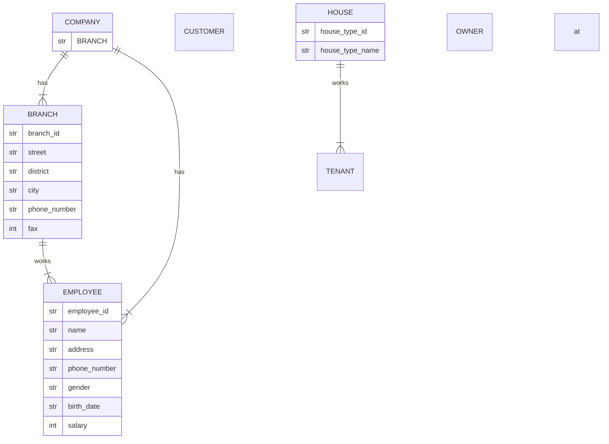

# ERD

```mermaid
erDiagram
    COMPANY {
        str BRANCH
    }
    CUSTOMER {

    }
    BRANCH {
        str branch_id
        str street
        str district
        str city
        str phone_number
        int fax
    }
    HOUSE {
        str house_type_id
        str house_type_name
    }
    OWNER {
    
    }
    EMPLOYEE {
        str employee_id
        str name
        str address
        str phone_number
        str gender
        str birth_date
        int salary
    }
    TENANT {

    }
    BRANCH ||--|{ EMPLOYEE: works at
    HOUSE ||--|{ TENANT: works at


    COMPANY ||--|{ BRANCH: has
    COMPANY ||--|{ EMPLOYEE: has
```
