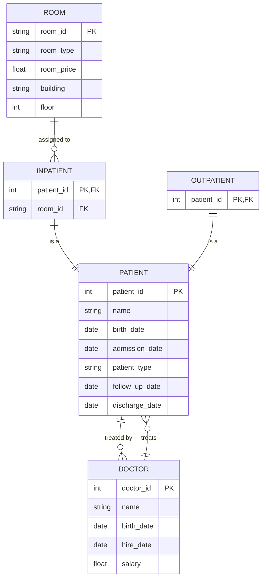

### ER Diagram


### Relational Schema

**PATIENT (patient_id, name, birth_date, admission_date, patient_type, follow_up_date, discharge_date)**

**DOCTOR (doctor_id, name, birth_date, hire_date, salary)**

**ROOM (room_id, room_type, room_price, building, floor)**

**INPATIENT (patient_id, room_id)**

**OUTPATIENT (patient_id)**

- Each `PATIENT` is treated by one or more `DOCTOR`.
- Each `DOCTOR` can treat zero or more `PATIENT`.
- Each `INPATIENT` is assigned to one `ROOM`.
- Each `ROOM` can have zero or more `INPATIENT`.
- Each `PATIENT` can be either an `INPATIENT` or an `OUTPATIENT`.
```