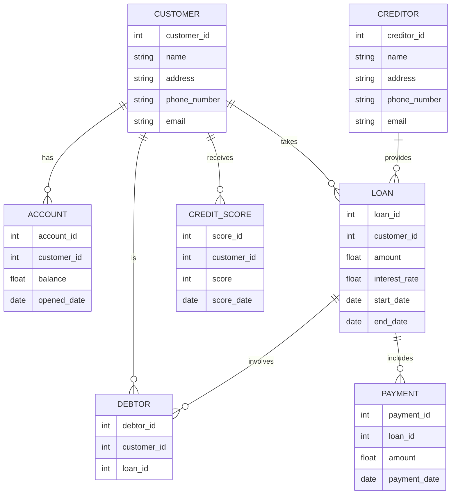

# Credit Scoring ERD

```mermaid
erDiagram
    CUSTOMER {
        int customer_id
        string name
        string address
        string phone_number
        string email
    }
    ACCOUNT {
        int account_id
        int customer_id
        float balance
        date opened_date
    }
    LOAN {
        int loan_id
        int customer_id
        float amount
        float interest_rate
        date start_date
        date end_date
    }
    PAYMENT {
        int payment_id
        int loan_id
        float amount
        date payment_date
    }
    CREDIT_SCORE {
        int score_id
        int customer_id
        int score
        date score_date
    }
    CREDITOR {
        int creditor_id
        string name
        string address
        string phone_number
        string email
    }
    DEBTOR {
        int debtor_id
        int customer_id
        int loan_id
    }

    CUSTOMER ||--o{ ACCOUNT : has
    CUSTOMER ||--o{ LOAN : takes
    LOAN ||--o{ PAYMENT : includes
    CUSTOMER ||--o{ CREDIT_SCORE : receives
    CREDITOR ||--o{ LOAN : provides
    CUSTOMER ||--o{ DEBTOR : is
    LOAN ||--o{ DEBTOR : involves
```