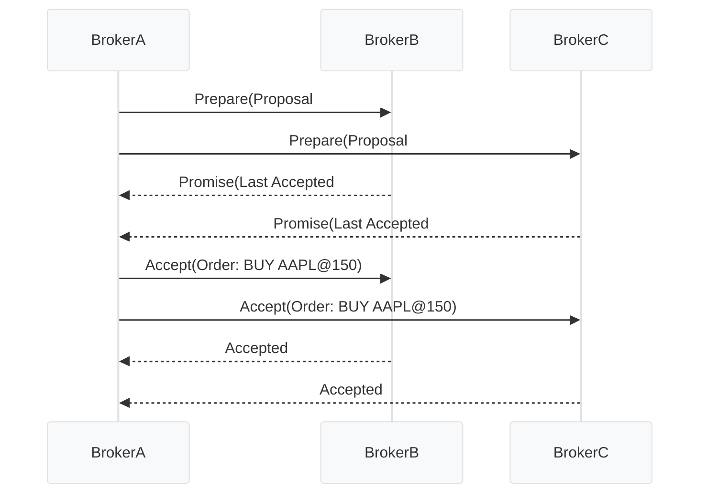
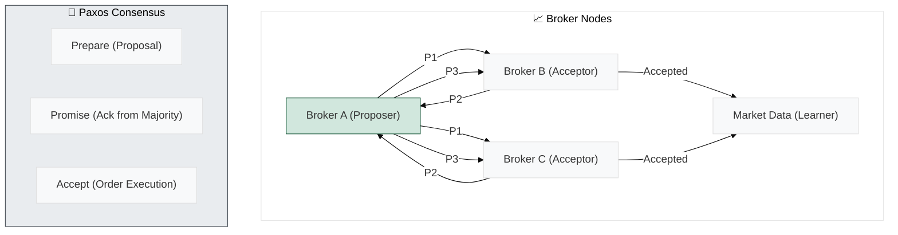
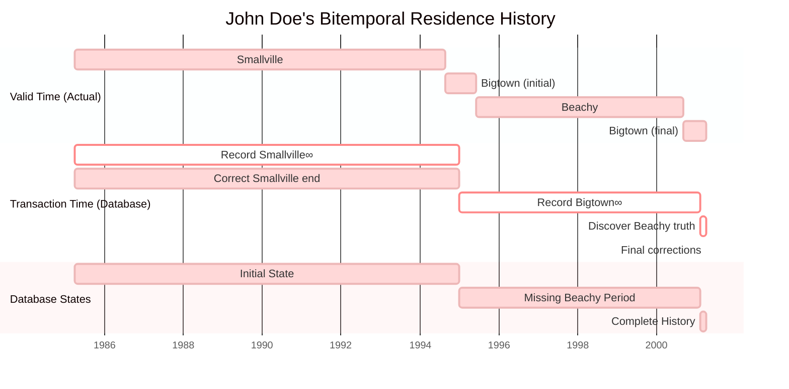
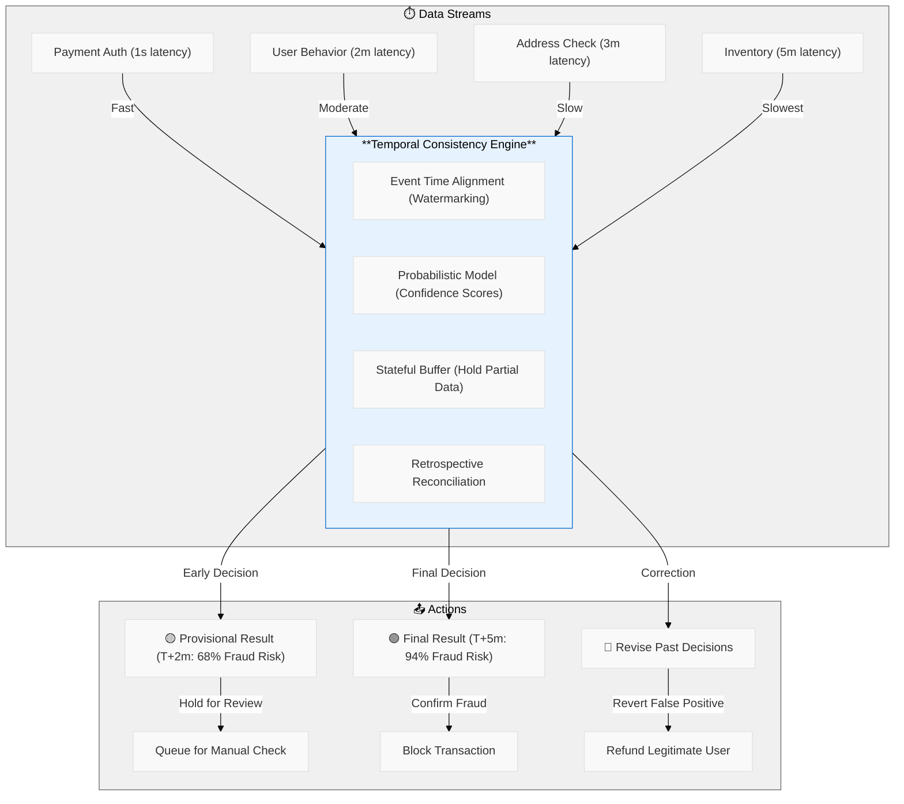
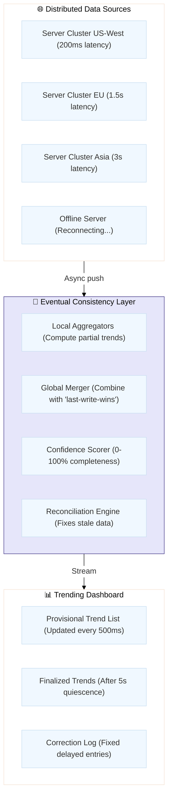
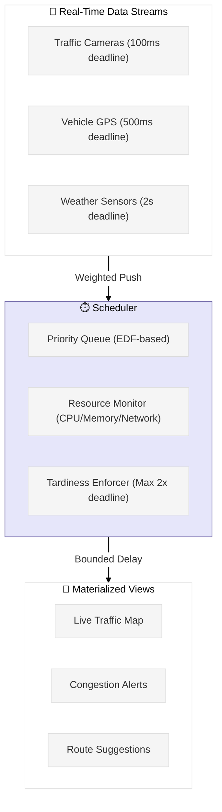
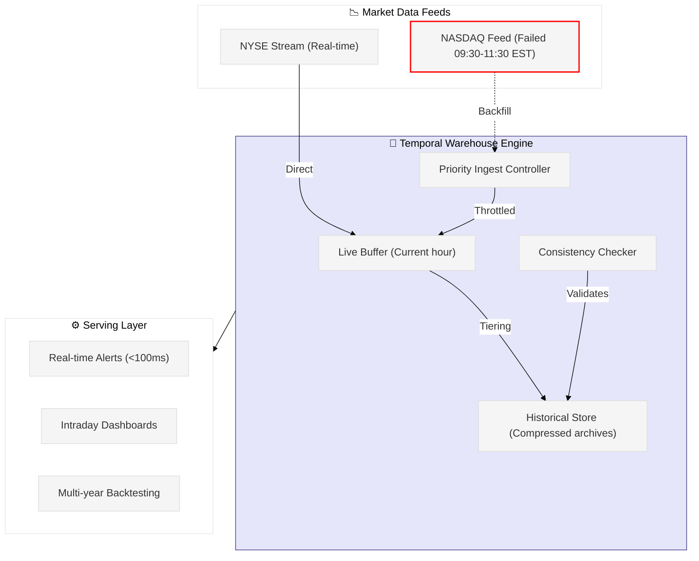

# Diagram

Tran Dinh Hung có câu hỏi: Trong trường hợp dữ liệu bị thiếu mất một ngày hôm kia (tuy nhiên, chỉ một vài trường bị thiếu và thiếu ngẫu nhiên), thì hệ thống tiến hành sửa lỗi như thế nào?

Mình có câu hỏi: (nhóm 4) về temporal data, dạng data này có vẻ tương tự như time-series data, v có điểm khác biệt giữa 2 loại data này k, hay time-series data là tập con của temporal data

Mine (nhóm 8) Theo bạn thì cyber security có phải là thách thức của Time Series Data ko? Tại sao?
- cyber security là thách thức của mọi thể loại data. không chỉ là một loại data, nó thuộc về hệ thống và cách quản lý security
Trong mấy buổi livestream chơi LoL thì có một số phần tử tấn công làm nghẽn mạng streaming á
Trong trường hợp bị hack lag hoặc kick out thì chắc phải có backfill data á (kiểu backup service/db) để failover. Bằng chứng là thấy lúc mình log in lại thì hero của mình đc fast forward tới hiện tại. 😆

Nhóm Tung Phan mình có 1 số câu hỏi:
Cho thêm 1 số ví dụ về các low-latency algorithms và nếu chiều dữ liệu cũ mất đi thì mình có bị mất potential data ko.
system and hardware: dựa theo tiêu chí nào để triển khai AWS hay GCP
- Câu 2: một số tiêu chí mình nghiên cứu được:
nhu cầu sử dung hệ sinh thái nào
Độ trưởng thành, size của công ty, ưu tiên độ ổn định hay hướng tới những công nghệ mới? (VD:AWS tuổi đời lâu hơn, kiểm chứng độ bền cao hơn so với GCP)
Nhu cầu lưu trữ và data công ty thường xuyên xử lý như nào. Chi phí

Khoi Duong Nhóm 11 có câu hỏi ạ : Có khi nào dữ liệu thời gian bị “trễ” (delay) khi ghi nhận, thì lúc đó có những cách giải quyết như nào?
- Có. Mình có thể implement bi-temporal data để lưu data 2 chiều thời gian (bi = 2):
Thời gian valid (from / to)
Thời gian transaction (e.g. created_at, processed_at)
sẽ tùy vào vấn đề là gì mà sẽ có những cách giải quyết khác nhau.
nhưng đầu tiên thì sẽ phải tìm hiểu câu hỏi Why? sau đó mới tìm cách giaiar quyết cho rất nhiều trường hợp khác nhau

Nhóm 01 có câu hỏi cho nhóm Trang, chương 4: Thách thức về tính nhất quán thời gian (temporal consistency) được nêu bật, đặc biệt khi phân tích nhiều luồng dữ liệu từ các nguồn khác nhau với độ trễ khác nhau. Làm thế nào để xác định được thời điểm dữ liệu từ nhiều luồng đã được thu thập đầy đủ để tạo ra kết quả đáng tin cậy, và "lý thuyết và thực hành về tính nhất quán thời gian của luồng dữ liệu còn ở giai đoạn sơ khai" hàm ý những khó khăn cơ bản nào trong việc đảm bảo độ tin cậy của phân tích thời gian thực?
- như nhóm mình đã trình bày. tới hiện nay vấn đề này vẫn là một thách thức lớn (với cả những ông lớn trong ngành dữ liệu) - vì không dễ biết khi nào “đã đủ dữ liệu” mà không bỏ sót hay tính trùng.
hiện nay thực tế đang xử lý bang watermark và allowed lateness. nhưng không có gì là tuyệt đối vì nhiều nguồn data và độ trễ không đoán trước được
- nói chung vẫn phải đánh đổi giữa độ chính xác và độ trễ chứ không thể đảm bảo luôn đủ data tại 1 thời điểm được
- Strong consistency thì rất khó scale. Vì data phải đợi compute ngay lập tức. Temporal Consistency thì có nhiều kỹ thuật đc đề cập như:
Batch normalization
Sketching (sliding window/sampling)
Derived Format: Chuyển raw data thành dạng data nhỏ hơn / cần thiết hơn
Paxos algorithm: chọn data
Compute data tại chỗ (ví dụ FTRL optimizer - kết hợp momentum và regularisation)
Bounded-Tardiness: Siết thời gian valid của data.
etc.

Hoa Kieu Vo Nhóm 7 có câu hỏi nhỏ ạ: Nãy em có nghe ứng dụng fraud transaction detection trong lĩnh vực tài chính. Thường em thấy dữ liệu trong bank thường tổ chức dạng phân tán. Làm sao để đảm bảo vừa sync, vừa giữ được consistency, mà vuwfda  thực hiện kiểm tra được fraud một cách kịp thời ạ. Vì thường thời gian phát sinh giao dịch chỉ tính bằng giây :D
- Nhóm Khang có present Fault (Change-point) Detection thôi. Còn Fraud Detection thì để mình hiểu thêm về Temporal Consistency:
Suspicious Purchase Fraud Detection
T+0s: User places order
T+1s: Payment stream shows successful authorization
T+30s: Behavior analytics shows suspicious patterns (rushed checkout, pasted CVV)
T+2m: Address validation reveals mismatch with card billing address
T+5m: Inventory check shows laptops were previously flagged for fraud
Vì khi check out và submit order, mình sẽ gửi request tới bên thứ 3 để approve (e.g. NAPAS). Có thể kết hợp nhiều loại consistency:
Sync (Strong Consistency): Block further transactions until using lock mechanism. Strong consistency thường thấy bên trong các databases và services gần nhau
Temporal consistency: giống eventual consistency nhưng giới hạn thời gian. Ví dụ send/receive OTP/token exchange
- như mình có giới thiệu, một số giải pháp hiện tại nhu ingest all transactions vào hệ thống stream centralized (dung kafka, kinesis,..) để xử lý thời gian thực (thực tế là gần thực - nhưng độ trễ rất thấp nhưng chap nhận được là "realtime") bằng Flink hoặc Spark.
và chấp nhận eventual consistency và dùng state store để phân tích hành vi tức thời, thay vì cố gắng đồng bộ tuyệt đối giữa các hệ thống phân tán.

Nhóm 2 có câu hỏi cho nhóm 3 ạ: Nếu dữ liệu liên tục thay đổi theo thời gian, như trong giao dịch tài chính hoặc hệ thống IoT, khi thiết kế mô hình machine learning như thế nào để nó tự cập nhật mà không phải huấn luyện lại từ đầu? Thì mình nên chọn kỹ thuật hoặc thuật toán này để thực hiện bài toán này.
Thanks @Tùng Phan . Quá đúng. Nhưng mà lưu ý: SGD sẽ bị high cost. Thường time series từ dữ liệu IoT rất rất lớn. Mình chạy SGD cho mỗi time t thì sẽ rất hao phí resources. Mình có thể dùng mini Batch để giảm tải. Nếu sợ bị outlier thì nên đổi SGD thành Adam hoặc thêm momentum.
