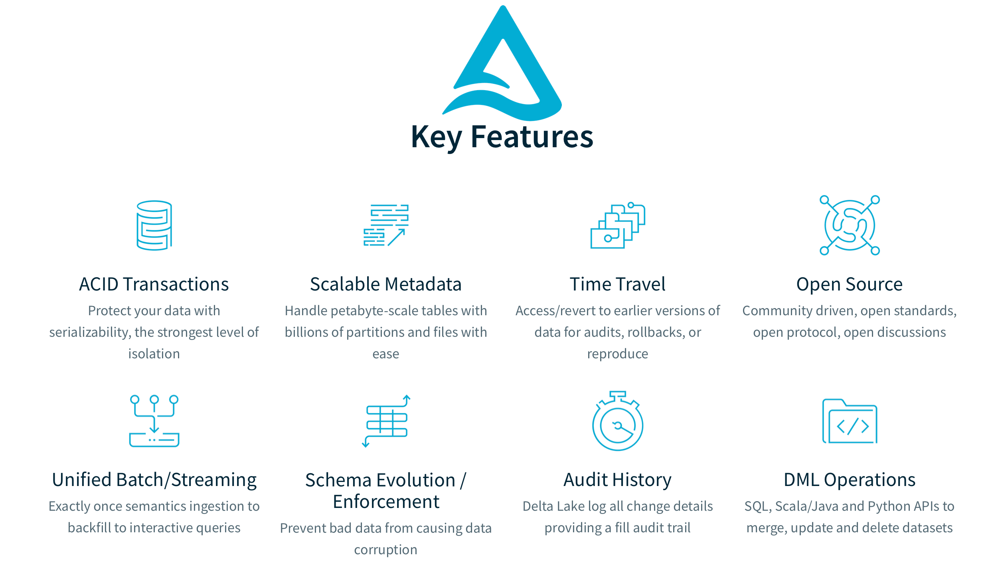
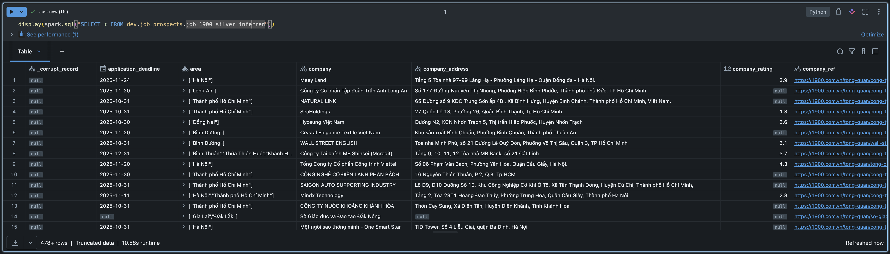
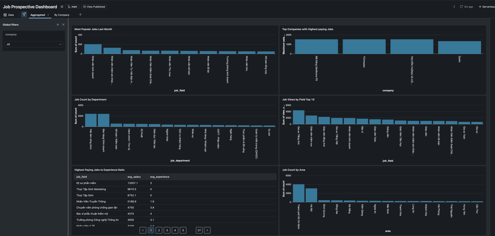
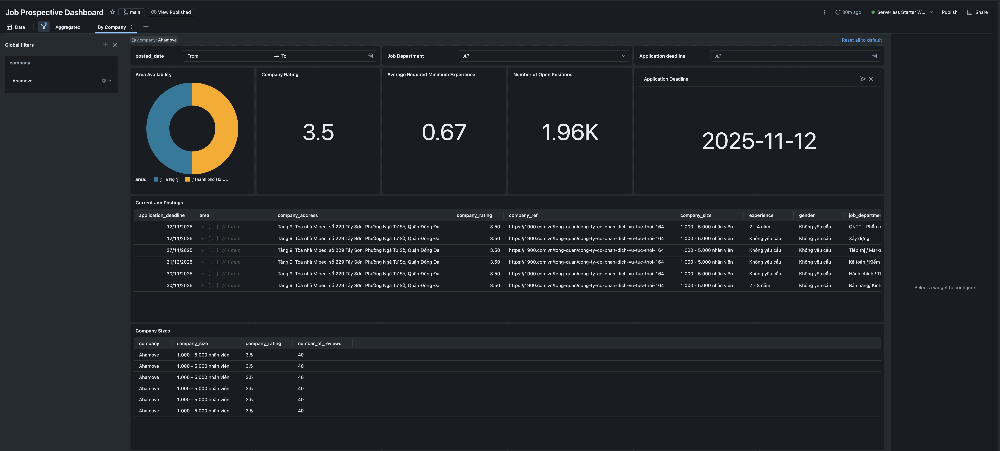

<!-- # 1. Xây dựng Pipeline Kỹ thuật Dữ liệu End-to-End cho Phân tích Thị trường Lao động -->

# 1. Triển khai Kiến trúc Databricks Lakehouse sử dụng Dữ liệu từ 1900.com.vn

**Môn học:** Kỹ thuật Dữ liệu (Data Engineering)  
**Sinh viên thực hiện:** Khang Nghiêm  
**Ngày thực hiện:** Tháng 10 năm 2023

---

# 2. Mục lục

- [1. Triển khai Kiến trúc Databricks Lakehouse sử dụng Dữ liệu từ 1900.com.vn](#1-triển-khai-kiến-trúc-databricks-lakehouse-sử-dụng-dữ-liệu-từ-1900comvn)
- [2. Mục lục](#2-mục-lục)
- [3. Lời mở đầu](#3-lời-mở-đầu)
- [4. Giới thiệu](#4-giới-thiệu)
  - [4.1. Bối cảnh và Lý do chọn đề tài](#41-bối-cảnh-và-lý-do-chọn-đề-tài)
  - [4.2. Mục tiêu của Dự án](#42-mục-tiêu-của-dự-án)
  - [4.3. Phạm vi Nghiên cứu](#43-phạm-vi-nghiên-cứu)
- [5. Cơ sở Lý thuyết và Kiến trúc Hệ thống](#5-cơ-sở-lý-thuyết-và-kiến-trúc-hệ-thống)
  - [5.1. Mô hình Databricks Lakehouse](#51-mô-hình-databricks-lakehouse)
  - [5.2. Công nghệ Delta Lake](#52-công-nghệ-delta-lake)
  - [5.3. Công nghệ Apache Spark](#53-công-nghệ-apache-spark)
- [6. Chiến lược Thu thập Dữ liệu](#6-chiến-lược-thu-thập-dữ-liệu)
  - [6.1. Kỹ thuật Web Scraping với Scrapy](#61-kỹ-thuật-web-scraping-với-scrapy)
  - [6.2. Các vấn đề Đạo đức và Tuân thủ](#62-các-vấn-đề-đạo-đức-và-tuân-thủ)
- [7. Triển khai ETL: Kiến trúc Medallion](#7-triển-khai-etl-kiến-trúc-medallion)
  - [7.1. Lớp Bronze: Nhập liệu Thô (Raw Ingestion)](#71-lớp-bronze-nhập-liệu-thô-raw-ingestion)
- [8. Kỹ thuật Web Scraping với Scrapy](#8-kỹ-thuật-web-scraping-với-scrapy)
  - [8.1. Lớp Silver: Chuyển đổi và Làm sạch (Transformation \& Cleansing)](#81-lớp-silver-chuyển-đổi-và-làm-sạch-transformation--cleansing)
    - [8.1.1. Batch Inference trên Databricks: Phân loại Địa điểm Thành phố Việt Nam](#811-batch-inference-trên-databricks-phân-loại-địa-điểm-thành-phố-việt-nam)
    - [8.1.2. Tối ưu hóa Hiệu năng](#812-tối-ưu-hóa-hiệu-năng)
  - [8.2. Kiểm thử Chất lượng](#82-kiểm-thử-chất-lượng)
    - [8.2.1. Kiểm thử Logic Chuyển đổi (Unit Testing)](#821-kiểm-thử-logic-chuyển-đổi-unit-testing)
    - [8.2.2. Kiểm soát Chất lượng Phân loại AI](#822-kiểm-soát-chất-lượng-phân-loại-ai)
  - [8.3. Lớp Gold: Tổng hợp Nghiệp vụ (Business Aggregation)](#83-lớp-gold-tổng-hợp-nghiệp-vụ-business-aggregation)
  - [8.4. Databricks Declarative Pipelines: Tự động hóa Thế hệ mới](#84-databricks-declarative-pipelines-tự-động-hóa-thế-hệ-mới)
- [9. Điều phối và Tự động hóa (Orchestration)](#9-điều-phối-và-tự-động-hóa-orchestration)
  - [9.1. Thiết kế Workflow Đa tác vụ (Multi-Task Job)](#91-thiết-kế-workflow-đa-tác-vụ-multi-task-job)
  - [9.2. Các tính năng Nâng cao được áp dụng](#92-các-tính-năng-nâng-cao-được-áp-dụng)
- [10. Trực quan hóa và Phân tích Dữ liệu](#10-trực-quan-hóa-và-phân-tích-dữ-liệu)
    - [10.1. Dashboard Tổng quan Thị trường (Market Overview)](#101-dashboard-tổng-quan-thị-trường-market-overview)
    - [10.2. Dashboard Chi tiết và Tương tác (Interactive Filtering)](#102-dashboard-chi-tiết-và-tương-tác-interactive-filtering)
- [11. Thách thức và Hạn chế](#11-thách-thức-và-hạn-chế)
  - [11.1. Thách thức về Chất lượng và Xử lý Dữ liệu (Data Quality \& Processing Challenges)](#111-thách-thức-về-chất-lượng-và-xử-lý-dữ-liệu-data-quality--processing-challenges)
  - [11.2. Thách thức về Thu thập Dữ liệu (Ingestion Challenges)](#112-thách-thức-về-thu-thập-dữ-liệu-ingestion-challenges)
  - [11.3. Hạn chế về Hạ tầng và Công nghệ (Infrastructure \& Technology Limitations)](#113-hạn-chế-về-hạ-tầng-và-công-nghệ-infrastructure--technology-limitations)
  - [11.4. Hạn chế trong Phân tích Nâng cao (Advanced Analytics Limitations)](#114-hạn-chế-trong-phân-tích-nâng-cao-advanced-analytics-limitations)
- [12. Kết luận và Hướng phát triển](#12-kết-luận-và-hướng-phát-triển)
- [13. Tài liệu Tham khảo](#13-tài-liệu-tham-khảo)

---

# 3. Lời mở đầu

Trong bối cảnh thị trường tuyển dụng đang thay đổi nhanh chóng, những thông tin chi tiết dựa trên dữ liệu (data-driven insights) đóng vai trò then chốt trong việc thấu hiểu các xu hướng lao động. Báo cáo này trình bày chi tiết quá trình thiết kế và triển khai một pipeline kỹ thuật dữ liệu toàn diện được lưu trữ trên nền tảng đám mây Databricks. Mục tiêu cốt lõi của dự án là thu thập, xử lý và phân tích dữ liệu tuyển dụng từ trang web **1900.com.vn** nhằm đưa ra các nhận định sâu sắc về phân phối mức lương, nhu cầu kỹ năng và sự tăng trưởng của các ngành nghề.

Hệ thống được xây dựng dựa trên **Kiến trúc Data Lakehouse**, tận dụng sức mạnh của Delta Lake để đảm bảo tính tuân thủ ACID và thực thi lược đồ (schema enforcement) nghiêm ngặt. Quy trình bắt đầu với một module thu thập dữ liệu web (web scraping) được xây dựng bằng Python (Scrapy) tuân thủ các chuẩn mực đạo đức, tiếp nối qua quy trình ETL ba giai đoạn (Bronze, Silver, Gold) theo mô hình Medallion, và kết thúc bằng một dashboard tương tác trực quan. Báo cáo này không chỉ tài liệu hóa quá trình triển khai kỹ thuật mà còn thảo luận sâu về các khía cạnh đạo đức dữ liệu và kết quả phân tích thực tế.

---

# 4. Giới thiệu

## 4.1. Bối cảnh và Lý do chọn đề tài

Thị trường lao động Việt Nam hiện nay được đặc trưng bởi sự biến động cao và tốc độ chuyển đổi số mạnh mẽ. Các phương pháp phân tích thị trường lao động truyền thống thường dựa vào các chỉ số có độ trễ lớn, chẳng hạn như các báo cáo quý của chính phủ hoặc các tổ chức thống kê. Trong khi đó, dữ liệu thời gian thực từ các cổng thông tin việc làm như 1900.com.vn cung cấp một cái nhìn chi tiết, tức thời và đa chiều về động lực thị trường.

Tuy nhiên, nguồn dữ liệu này vốn dĩ phi cấu trúc (unstructured), chứa nhiều nhiễu (noise) và có tính chất tưc thời, thay đổi liên tục theo thời gian. Một tin tuyển dụng có thể xuất hiện và biến mất trong vài ngày, và định dạng dữ liệu thường không đồng nhất giữa các nhà tuyển dụng. Do đó, việc xây dựng một hệ thống kỹ thuật dữ liệu mạnh mẽ để chuyển đổi nguồn dữ liệu thô này thành thông tin tình báo (business intelligence) có thể hành động là một nhu cầu cấp thiết và mang tính thực tiễn cao.

## 4.2. Mục tiêu của Dự án

Mục tiêu chính của bài tập lớn này là chứng minh năng lực áp dụng các quy trình kỹ thuật dữ liệu hiện đại vào giải quyết bài toán thực tế. Các mục tiêu cụ thể bao gồm:

1. **Thu thập Dữ liệu (Data Ingestion):** Phát triển một trình thu thập thông tin (crawler) có khả năng mở rộng để trích xuất dữ liệu việc làm, đồng thời tuân thủ nghiêm ngặt các tiêu chuẩn đạo đức về web scraping.
2. **Thiết kế Kiến trúc (Architecture Design):** Triển khai kiến trúc Databricks Lakehouse sử dụng mô hình Medallion (Bronze/Silver/Gold) để quản lý vòng đời dữ liệu.
3. **Chuyển đổi Dữ liệu (Data Transformation):** Làm sạch dữ liệu JSON bán cấu trúc, xử lý các giá trị null, chuẩn hóa các trường thông tin quan trọng như lương, địa điểm, và kỹ năng để phục vụ phân tích.
4. **Trực quan hóa (Visualization):** Xây dựng dashboard thông minh (Business Intelligence) để trực quan hóa các chỉ số chính như mức lương trung bình theo vùng miền, các ngành nghề đang là xu hướng (trending), và phân bố kỹ năng yêu cầu.

## 4.3. Phạm vi Nghiên cứu

Dự án tập trung duy nhất vào nguồn dữ liệu công khai trên trang web 1900.com.vn. Về mặt công nghệ, dự án xoay quanh hệ sinh thái **Databricks Free Edition**, sử dụng **Apache Spark (PySpark)** làm bộ máy xử lý chính, **Delta Lake** làm lớp lưu trữ, và **Scrapy** cho việc thu thập dữ liệu.

---

# 5. Cơ sở Lý thuyết và Kiến trúc Hệ thống

## 5.1. Mô hình Databricks Lakehouse
Dự án này áp dụng kiến trúc **Databricks Lakehouse**, một nền tảng kết hợp những ưu điểm của Data Lake và Data Warehouse:

- **Từ Data Lake:** Linh hoạt chấp nhận mọi định dạng dữ liệu (JSON, CSV, unstructured) với chi phí thấp và khả năng mở rộng lớn. Schema evolution cho phép tự động thích ứng khi cấu trúc dữ liệu thay đổi, quan trọng với dữ liệu web scraping không ổn định.

- **Từ Data Warehouse:** Tính toàn vẹn giao dịch (ACID), thực thi lược đồ nghiêm ngặt, và hiệu năng truy vấn cao cho phân tích.

Cách tiếp cận này giải quyết "silos dữ liệu" bằng cách lưu trữ dữ liệu thô và tinh chỉnh dần qua các lớp (Bronze → Silver → Gold) trên cùng một nền tảng, giảm độ trễ dữ liệu và loại bỏ sao chép dư thừa.

Ngoài ra, Databricks Lakehouse cung cấp:

- **Hỗ trợ đa ngôn ngữ:** Cho phép sử dụng linh hoạt Python, SQL, Scala và R trên cùng một dữ liệu, giúp các kỹ sư dữ liệu và nhà phân tích cộng tác hiệu quả.
- **Môi trường cộng tác thống nhất:** Kiến trúc này xóa bỏ rào cản truyền thống giữa các nhóm kỹ thuật. Kỹ sư dữ liệu (Data Engineers), Nhà khoa học dữ liệu (Data Scientists) và Chuyên viên phân tích (Data Analysts) có thể làm việc đồng thời trên cùng một nguồn dữ liệu duy nhất (Single Source of Truth), giúp loại bỏ độ trễ do sao chép dữ liệu và đảm bảo tính nhất quán trong toàn bộ quy trình phân tích.
- **Unity Catalog:** Cung cấp giải pháp quản trị dữ liệu thống nhất, cho phép kiểm soát quyền truy cập chi tiết đến từng dòng và cột, đảm bảo an toàn dữ liệu.
- **Auto Loader:** Tự động hóa việc nhập dữ liệu mới từ các tệp tin (JSON, CSV) ngay khi chúng xuất hiện trong storage, giúp pipeline (Databricks Declarative Pipelines) hoạt động gần như thời gian thực (near real-time).

## 5.2. Công nghệ Delta Lake

Ngay tại trung tâm của việc triển khai kiến trúc này là **Delta Lake**, một lớp lưu trữ mã nguồn mở mang tính cách mạng, được thiết kế để mang lại độ tin cậy, hiệu suất và khả năng quản trị cho các Data Lakes. Trong khi các Data Lake truyền thống (như S3 hay HDFS thuần túy) thường gặp khó khăn với các vấn đề về tính nhất quán dữ liệu và hiệu suất khi quy mô tăng lên, Delta Lake giải quyết triệt để các thách thức này bằng cách hoạt động như một lớp trung gian thông minh. Các tính năng cốt lõi của Delta Lake được khai thác tối đa trong dự án này bao gồm:

- **Giao dịch ACID (Atomicity, Consistency, Isolation, Durability):** Đây là tính năng quan trọng nhất giúp Delta Lake khác biệt so với các định dạng lưu trữ file thông thường (như Parquet hay CSV). Trong môi trường Big Data, việc ghi dữ liệu có thể bị gián đoạn do lỗi mạng hoặc lỗi phần cứng. Delta Lake đảm bảo tính nguyên tử (Atomicity) - nghĩa là mọi thao tác ghi dữ liệu (batch hoặc streaming) đều thành công hoàn toàn hoặc thất bại hoàn toàn, không bao giờ để lại trạng thái dữ liệu "lửng lơ" hay rác (corrupted data). Điều này đảm bảo rằng các dashboard phân tích ở cuối pipeline luôn hiển thị dữ liệu nhất quán và chính xác, ngay cả khi quá trình ETL đang diễn ra song song.

  - **Atomicity (Tính nguyên tử):** Mỗi phép ghi dữ liệu hoàn toàn thành công hoặc hoàn toàn thất bại. Ví dụ: nếu quá trình nạp 100,000 bản ghi bị gián đoạn ở giữa, toàn bộ dữ liệu sẽ được hôi phục về trạng thái ban đầu, không để lại dữ liệu rác.

  - **Consistency (Tính nhất quán):** Delta Lake tự động kiểm tra lược đồ và từ chối mọi dữ liệu không tuân thủ. Nếu cột yêu cầu kiểu `DOUBLE` nhưng nhận được chuỗi text, phép ghi sẽ bị từ chối ngay.

  - **Isolation (Tính cách ly):** Khi nhiều quá trình đọc/ghi cùng một bảng, Delta Lake đảm bảo chúng không nhìn thấy dữ liệu trung gian hay không hoàn chỉnh. Lớp Silver sẽ không bao giờ lấy được dữ liệu bán phần từ lớp Bronze.

  - **Durability (Tính bền vững):** Dữ liệu được ghi lên cloud storage (S3, Azure Data Lake) với bản sao lưu nội tại. Delta Lake cũng duy trì nhật ký ghi trước (write-ahead logs) để phục hồi chính xác nếu có sự cố.

- **Thực thi và Tiến hóa Lược đồ (Schema Enforcement & Schema Evolution):**

  - Tính năng _Schema Enforcement_ tự động ngăn chặn việc ghi dữ liệu sai định dạng hoặc không khớp với lược đồ đã định nghĩa, bảo vệ chất lượng dữ liệu ở lớp Silver và Gold. Tuy nhiên, trong bối cảnh dữ liệu web scraping thường xuyên thay đổi
  - tính năng _Schema Evolution_ lại cho phép hệ thống linh hoạt tự động cập nhật lược đồ bảng để chấp nhận các cột mới mà không cần phải viết lại toàn bộ bảng, giúp pipeline thích ứng nhanh chóng với sự thay đổi của trang web nguồn.

- **Xử lý Metadata có khả năng mở rộng (Scalable Metadata Handling):** Đối với các dự án dữ liệu lớn, metadata (thông tin về dữ liệu) có thể trở nên khổng lồ, khiến các thao tác truy vấn trở nên chậm chạp. Delta Lake xử lý metadata giống như dữ liệu thông thường, sử dụng sức mạnh phân tán của Spark để quản lý hàng triệu, thậm chí hàng tỷ file một cách hiệu quả. Điều này cho phép truy vấn nhanh chóng ngay cả trên các bảng lịch sử chứa dữ liệu tích lũy trong nhiều năm.

- **Time Travel (Du hành thời gian) và Kiểm toán Dữ liệu:** Delta Lake tự động lưu trữ lịch sử phiên bản của dữ liệu (data versioning). Tính năng này cho phép các nhà phân tích truy vấn lại trạng thái chính xác của dữ liệu tại bất kỳ thời điểm nào trong quá khứ. Trong bối cảnh phân tích thị trường lao động, điều này cực kỳ giá trị để:

  - **Phân tích xu hướng:** So sánh sự thay đổi của cùng một tin tuyển dụng theo thời gian (ví dụ: nhà tuyển dụng có tăng lương sau 2 tuần không tuyển được người hay không?).
  - **Khôi phục lỗi:** Dễ dàng quay lại phiên bản dữ liệu trước đó (rollback) nếu một quy trình ETL bị lỗi ghi đè dữ liệu sai, mà không cần phải khôi phục từ bản backup phức tạp.
  - **Tái lập kết quả:** Đảm bảo khả năng tái lập (reproducibility) cho các mô hình học máy bằng cách truy xuất đúng phiên bản dữ liệu đã dùng để huấn luyện.

- **Nền tảng lưu trữ Parquet:** Delta Lake được xây dựng trên định dạng tệp **Parquet** mã nguồn mở. Đây là định dạng lưu trữ dạng cột (columnar storage) tối ưu, cho phép nén dữ liệu hiệu quả cao và chỉ đọc các cột cần thiết trong quá trình truy vấn (column pruning). Việc sử dụng Parquet đảm bảo dữ liệu được lưu trữ theo chuẩn công nghiệp, không bị khóa vào một nhà cung cấp cụ thể (vendor lock-in) và tối ưu hóa chi phí lưu trữ.

- **Tối ưu hóa Hiệu năng và Liquid Clustering:** Để giải quyết các thách thức về hiệu suất khi dữ liệu tăng trưởng, hệ thống sử dụng các kỹ thuật tiên tiến:
  - **Compaction:** Tự động gộp các file Parquet nhỏ thành các file lớn hơn để giảm thiểu chi phí I/O (vấn đề small file problem).
  - **Liquid Clustering:** Thay thế cho các phương pháp phân vùng (partitioning) và Z-Ordering cứng nhắc truyền thống, Liquid Clustering là một kỹ thuật quản lý bố cục dữ liệu linh hoạt. Nó tự động điều chỉnh cách dữ liệu được phân cụm vật lý dựa trên các mẫu truy vấn thực tế, giúp giải quyết vấn đề lệch dữ liệu (data skew) và tối ưu hóa khả năng bỏ qua dữ liệu (data skipping) mà không cần sự can thiệp thủ công phức tạp từ kỹ sư dữ liệu.


Hình 1 Các đặc tính quan trọng của Databricks

## 5.3. Công nghệ Apache Spark

**Apache Spark** là nền tảng xử lý dữ liệu phân tán (distributed computing framework) mã nguồn mở, được phát triển ban đầu tại UC Berkeley AMP Lab vào năm 2009 và hiện nay là một trong những công nghệ xử lý Big Data phổ biến nhất trên thế giới. Spark được lựa chọn làm "động cơ" chính của dự án này vì khả năng xử lý tập dữ liệu lớn với tốc độ ấn tượng, đồng thời cung cấp các API đơn giản và linh hoạt để triển khai các quy trình ETL phức tạp.

**Kiến trúc và Nguyên lý Hoạt động (Architecture & Principles):**

Spark hoạt động theo mô hình Driver-Worker, nơi tác vụ (Task) được phân chia thành các phần nhỏ và phân tán lên nhiều máy tính (nodes) để xử lý song song:

- **Driver:** Là "bộ não" của Spark job, chạy trên máy chủ trung tâm (hoặc Databricks notebook cell), chịu trách nhiệm phân tích mã Python/SQL, tạo ra kế hoạch thực thi (Execution Plan) và điều phối toàn bộ quá trình.
- **Executors:** Là các worker processes chạy trên các cluster nodes khác nhau, thực hiện các phép tính thực tế trên dữ liệu được gán cho chúng. Các executor được tạo ra khi cluster khởi động và tồn tại trong suốt vòng đời của Spark application.
- **Cluster Manager:** Quản lý phân bổ tài nguyên (CPU, Memory) cho các executor. Trong bối cảnh Databricks, Cluster Manager này được tích hợp sâu và tự động quản lý.

**Khái niệm Serverless Computing:**

Serverless Computing là mô hình điện toán đám mây nơi nhà cung cấp quản lý toàn bộ hạ tầng. Nhà phát triển chỉ cần viết code mà không phải quản lý máy chủ. Tài nguyên tự động mở rộng khi cần thiết, và bạn chỉ trả tiền cho thời gian thực tế sử dụng.

**Ứng dụng trong Databricks:**

Databricks Free Edition sử dụng Serverless Compute để cung cấp khả năng xử lý Spark tự động. Khi thực thi notebook hoặc Job, Databricks sẽ tự động cấp phát tài nguyên tính toán cần thiết.

Lợi ích chính:
- **Tiết kiệm chi phí:** Chỉ trả tiền khi thực tế sử dụng, không phí duy trì cluster.
- **Đơn giản hóa vận hành:** Không phải quản lý cluster, worker nodes hay bộ nhớ.
- **Độ tin cậy cao:** Nền tảng tự động phục hồi khi lỗi, đảm bảo pipeline ổn định.

**Resilient Distributed Datasets (RDD) - Nền tảng Dữ liệu:**

RDD là khái niệm cơ bản nhất trong Spark, đại diện cho một tập dữ liệu bất biến (immutable), phân tán trên nhiều partition, có khả năng phục hồi nhanh chóng nếu một node bị lỗi. Mỗi RDD được chia thành các phần (partitions) nhỏ, mỗi partition có thể được xử lý độc lập trên các executor khác nhau, cho phép xử lý song song.

**DataFrame & Spark SQL - Lớp Trừu tượng Cấp cao (High-Level API):**

Mặc dù RDD rất mạnh mẽ nhưng có mức độ phức tạp cao. Để đơn giản hóa, Spark giới thiệu **DataFrame** (tương tự như Pandas DataFrame hoặc bảng SQL truyền thống), nơi dữ liệu được tổ chức thành các hàng (rows) và cột (columns) với lược đồ (schema) rõ ràng. Điều này cho phép:

- Viết mã dễ hiểu hơn sử dụng các phép toán phổ biến (select, filter, groupBy, join).
- Tối ưu hóa tự động (Catalyst Optimizer) giúp Spark tự động chuyển đổi các phép toán thành execution plan hiệu quả nhất.
- Sử dụng **Spark SQL**, một dialect SQL ANSI-compliant, cho phép nhà phân tích viết truy vấn SQL quen thuộc mà vẫn nhận được sức mạnh xử lý phân tán.


Hình 2 Truy vấn Delta Lakehouse bằng SQL (ANSI) trên Databricks Notebook

**PySpark - Giao diện Python:**

Dự án này sử dụng **PySpark**, giao diện Python cho Spark. PySpark cho phép các kỹ sư dữ liệu viết code xử lý Big Data trong Python quen thuộc, mà không phải chuyển sang Scala hay Java. Điều này giảm đáng kể thời gian học tập và tăng tốc độ phát triển.

**Ưu điểm Cốt lõi Được Tận dụng trong Dự án:**

1. **Xử lý Lô (Batch Processing) Hiệu quả:** Dự án sử dụng Spark để đọc hàng triệu bản ghi JSON thô từ layer Bronze, thực hiện các phép biến đổi phức tạp (regex parsing, join, aggregation) trên layer Silver/Gold. Spark xử lý các tác vụ này nhanh hơn hàng chục lần so với pandas hoặc SQL truyền thống.

2. **In-Memory Processing:** Spark lưu giữ dữ liệu trung gian trong bộ nhớ RAM (in-memory) thay vì ghi xuống đĩa sau mỗi phép toán, giảm I/O overhead đáng kể và tăng tốc độ tính toán.

3. **Caching và Tối ưu hóa Bộ nhớ (Caching & Memory Optimization):**
    Đối với các tập dữ liệu lớn được truy cập nhiều lần, Spark cho phép lưu giữ dữ liệu trung gian trong bộ nhớ cache bằng phương thức `.cache()` hoặc `.persist()`. Điều này đặc biệt hữu ích trong pipeline ETL nơi cùng một DataFrame được sử dụng trong nhiều phép toán liên tiếp, tránh phải tính toán lại từ đầu mỗi lần. Tuy nhiên, điều đáng lưu ý là cache trong dbfs (Databricks File System) trong Databricks Free Edition sẽ phải tự tay đưa vào Unity Catalog vì Phiên bản này không hỗ trợ liên kết dbfs tới Unity Catalog.

4. **Lazy Evaluation:** Spark không thực thi các phép toán ngay lập tức mà chờ đến khi có phép toán thực thi (như `show()`, `collect()`, `write()`). Điều này cho phép Spark tối ưu hóa toàn bộ chuỗi phép toán trước khi thực thi tương tự như SQL execution plan, tránh các tính toán không cần thiết.

---

# 6. Chiến lược Thu thập Dữ liệu

## 6.1. Kỹ thuật Web Scraping với Scrapy

Quá trình thu thập dữ liệu được thực hiện bằng **Scrapy**, một framework Python mạnh mẽ chuyên dụng cho việc crawling. Scrapy được lựa chọn thay vì Selenium hay BeautifulSoup vì kiến trúc bất đồng bộ (asynchronous) của nó. Trong truờng hợp html  động (dynamic) có thể dùng thư viện scrapy-playwright bổ sung. Điều này cho phép thực hiện hàng trăm yêu cầu (requests) đồng thời mà không cần tốn tài nguyên để render giao diện trình duyệt, giúp tăng tốc độ thu thập dữ liệu lên gấp nhiều lần.

Trình crawler được thiết kế để nhắm vào các cấu trúc HTML của 1900.com.vn, trích xuất các trường thông tin sau thông qua **ItemLoader** và **Field** definitions:

```python
from scrapy.loader import ItemLoader
from scrapy.loader.processors import TakeFirst, Identity, MapCompose
from scrapy import Item, Field
from w3lib.html import remove_tags

class JobProspectLoader(ItemLoader):
    """Custom ItemLoader để xử lý dữ liệu tuyển dụng"""
    default_output_processor = TakeFirst()
    default_input_processor = MapCompose(str.strip, remove_tags)


class JobProspectItem(Item):
    """Định nghĩa cấu trúc dữ liệu cho mỗi tin tuyển dụng"""
    link = Field()  # URL của tin tuyển dụng
    title = Field()  # Tên vị trí công việc
    company_name = Field()  # Tên công ty tuyển dụng
    company_address = Field()  # Địa chỉ trụ sở công ty
    company_map_link = Field()  # Link bản đồ vị trí công ty
    company_size = Field()  # Quy mô công ty
    company_contact = Field()  # Thông tin liên hệ công ty
    area = Field(output_processor=Identity())  # Danh sách khu vực làm việc
    views = Field()  # Số lượt xem 
    expiry_date = Field()  # Ngày hết hiệu lực tin tuyển dụng
    job_description = Field(output_processor=Identity())  # Mô tả chi tiết công việc
    job_requirements = Field(output_processor=Identity())  # Yêu cầu công việc
    job_posted_date = Field()  # Ngày đăng tin
    job_department = Field()  # Bộ phận
    job_field = Field()  # Loại công việc
    job_minimum_experience = Field()  # Kinh nghiệm tối thiểu yêu cầu
    job_level = Field()  # Cấp bậc 
    job_skills = Field()  # Danh sách kỹ năng yêu cầu
    document_language = Field()  # Ngôn ngữ tin tuyển dụng
    nationality = Field()  # Quốc tịch yêu cầu (nếu có)
    work_address = Field()  # Địa chỉ cụ thể nơi làm việc
    tags = Field(output_processor=Identity())  # Các tag/nhãn phân loại
```

Mỗi trường thông tin được trích xuất một cách có tổ chức, với các bộ xử lý (processors) tùy chỉnh nhằm loại bỏ HTML tags, chuẩn hóa khoảng trắng, và xử lý các danh sách dữ liệu phức tạp.

## 6.2. Các vấn đề Đạo đức và Tuân thủ

Một thành phần quan trọng không thể thiếu trong dự án kỹ thuật này là việc tuân thủ nghiêm ngặt các thực hành thu thập dữ liệu có đạo đức và pháp lý. Trong kỷ nguyên số, ranh giới giữa việc khai thác dữ liệu công khai và xâm phạm quyền riêng tư hay tài sản trí tuệ thường rất mong manh. Việc scraping tự động nếu không được kiểm soát không chỉ có thể gây quá tải cho máy chủ mục tiêu (gây ra các cuộc tấn công DoS không chủ ý) mà còn vi phạm các quy định về sở hữu dữ liệu và điều khoản sử dụng. Do đó, dự án này đặt ưu tiên hàng đầu cho việc xây dựng một "Crawler văn minh".

**Các giao thức đạo đức và kỹ thuật đã được triển khai chi tiết:**

1. **Tuân thủ Robots.txt:**

    - Trước khi bắt đầu bất kỳ phiên thu thập nào, crawler được lập trình để tự động truy xuất và phân tích file `robots.txt` của trang web mục tiêu. Hệ thống tuân thủ tuyệt đối các chỉ thị `User-agent` và `Disallow`. Nếu một đường dẫn bị cấm, crawler sẽ bỏ qua ngay lập tức.

2. **Cơ chế Giới hạn Tốc độ (Rate Limiting & Throttling):**

    - Để ngăn chặn hành vi giống tấn công từ chối dịch vụ (DDoS), spider được cấu hình với độ trễ tải xuống (download delay) ngẫu nhiên từ 3 đến 7 giây giữa các yêu cầu liên tiếp. Sự ngẫu nhiên này mô phỏng hành vi duyệt web của con người, tránh tạo ra các mẫu lưu lượng truy cập (traffic patterns) máy móc gây nghi ngờ.
    - Giới hạn số lượng yêu cầu đồng thời (concurrent requests) trên mỗi tên miền xuống mức thấp (tối đa 1-2 request cùng lúc) để đảm bảo băng thông của trang web mục tiêu không bị chiếm dụng, không ảnh hưởng đến trải nghiệm của người dùng thực.

2. **Bảo vệ Thông tin Cá nhân (PII Protection & GDPR/PDPA Compliance):**

    - Mặc dù dữ liệu trên các trang tuyển dụng thường là công khai, dự án vẫn áp dụng nguyên tắc tối thiểu hóa dữ liệu. Logic trích xuất được thiết kế để chủ động bỏ qua hoặc làm mờ (masking) các thông tin định danh cá nhân nhạy cảm (PII) nếu vô tình xuất hiện, chẳng hạn như số điện thoại cá nhân của HR, email cá nhân không thuộc tên miền doanh nghiệp, hoặc hình ảnh chân dung.
    - Dữ liệu thu thập tập trung hoàn toàn vào thực thể "Công việc" (Job) và "Công ty" (Company), không tập trung vào cá nhân cụ thể, đảm bảo tuân thủ tinh thần của các luật bảo vệ dữ liệu như Nghị định 13/2023/NĐ-CP của Việt Nam.

3. **Chiến lược Lưu trữ và Vòng đời Dữ liệu (Data Retention Policy):**

    - Dữ liệu thô (Raw HTML) chỉ được lưu trữ trong thời gian ngắn để phục vụ việc debug và kiểm chứng. Sau khi quá trình trích xuất (Extraction) hoàn tất vào lớp Bronze và dữ liệu sạch được đưa vào lớp Silver, các file thô sẽ được xóa định kỳ để giải phóng tài nguyên và giảm thiểu rủi ro rò rỉ dữ liệu.
    - Tất cả dữ liệu thu thập được cam kết chỉ sử dụng cho mục đích phân tích giáo dục, thống kê tổng hợp trong khuôn khổ môn học. Tuyệt đối không có hành vi bán lại dữ liệu (data reselling), tái xuất bản hàng loạt (republishing) để cạnh tranh với trang gốc, hay sử dụng cho mục đích thương mại hóa dưới bất kỳ hình thức nào.

4. **Xử lý Lỗi và "Back-off" Thông minh:**
    - Trong trường hợp máy chủ mục tiêu phản hồi với các mã lỗi 429 (Too Many Requests) hoặc 503 (Service Unavailable), crawler được lập trình để tự động kích hoạt cơ chế tăng thoờ luợng cấp số nhân "Exponential Back-off". Nghĩa là, nó sẽ tạm dừng hoạt động trong một khoảng thời gian tăng dần (ví dụ: 30s, 1 phút, 5 phút...) trước khi thử lại, thay vì liên tục gửi lại yêu cầu ngay lập tức, giúp server có thời gian phục hồi.

---

# 7. Triển khai ETL: Kiến trúc Medallion

Quy trình xử lý dữ liệu tuân theo kiến trúc "Medallion" tiêu chuẩn của Databricks, cải thiện dần chất lượng dữ liệu khi nó di chuyển qua các lớp của hệ thống.

## 7.1. Lớp Bronze: Nhập liệu Thô (Raw Ingestion)


# 8. Kỹ thuật Web Scraping với Scrapy

Dữ liệu được thu thập bằng **Scrapy**, một framework Python chuyên dụng cho web scraping. Scrapy được lựa chọn vì kiến trúc bất đồng bộ (asynchronous) cho phép gửi hàng trăm request cùng lúc mà không cần chờ từng phản hồi, giúp tăng tốc độ thu thập dữ liệu đáng kể.

**Ưu điểm chính của Scrapy:**

- **Xử lý song song hiệu quả:** Sử dụng Twisted engine để quản lý nhiều request đồng thời, tối ưu hóa băng thông.
- **Middleware linh hoạt:** Cho phép tự động xoay vòng User-Agent, xử lý cookie, và retry khi lỗi mạng.
- **Pipeline tích hợp:** Hỗ trợ validation, lưu trữ dữ liệu, và xuất ra nhiều định dạng (JSON, CSV) một cách có tổ chức.

Trình crawler được cấu hình để trích xuất các trường thông tin quan trọng từ 1900.com.vn thông qua **ItemLoader** và **Field definitions**, đảm bảo dữ liệu được thu thập một cách có cấu trúc và nhất quán.


- **Quy trình:** Dữ liệu thô được đưa vào Databricks DBFS (Hệ thống tệp Databricks). Sử dụng PySpark, dữ liệu này được đọc và sau đó được chuyển (transfer) vào bảng Delta nằm trong lớp **Bronze** của **Unity Catalog** với chế độ `append` (nối thêm).
- **Đặc điểm:**
  _**Schema-on-Read:** Không ép buộc kiểu dữ liệu tại bước này; mục tiêu là lưu giữ dữ liệu chính xác như nó tồn tại ở hệ thống nguồn để đảm bảo không mất mát thông tin.
  _ **Lịch sử:** Chứa toàn bộ lịch sử của tất cả các lần chạy scraping, bao gồm cả các bản ghi trùng lặp nếu cùng một công việc được scrape vào các ngày khác nhau.
  _ **Mã giả (Conceptual Code Snippet):**
- Ghi xuống Databricks /dbfs (file system) và transfer thẳng vào Databricks Unity Catalog ở tầng Bronze /Volume

## 8.1. Lớp Silver: Chuyển đổi và Làm sạch (Transformation & Cleansing)

- **Đầu vào:** Bảng Delta lớp Bronze.
- **Quy trình:** Đây là động cơ chuyển đổi chính của hệ thống.
  _**Khử trùng lặp (Deduplication):** Các dòng dữ liệu được khử trùng lặp dựa trên Job ID duy nhất, chỉ giữ lại bản ghi mới nhất.
  _ **Làm sạch (Cleaning):** Các thẻ HTML (`<br>`, `<div>`, `<li>`) được loại bỏ khỏi phần mô tả công việc để lấy văn bản thuần túy.
  _**Chuẩn hóa (Normalization):** Trường "Salary" thường là một chuỗi phức tạp (ví dụ: "10-15 Triệu", "Thỏa thuận", "Up to $1000"). Một logic xử lý chuỗi phức tạp (sử dụng Regular Expressions) được áp dụng để tách thành hai cột số: `min_salary` và `max_salary`, đồng thời quy đổi ngoại tệ về VND.
  _ **Ép kiểu (Type Casting):** Các chuỗi ngày tháng được chuyển đổi sang định dạng Timestamp chuẩn.
- **Đặc điểm:** Lược đồ được thực thi nghiêm ngặt, dữ liệu sạch, sẵn sàng cho các truy vấn ad-hoc của Data Analyst.
- Code:
  ```python
  # Đọc dữ liệu JSON thô từ /Volume
  def get_job_1900_bronze():
      bronze = (
          spark.read.option("multiline", "true")
          .format("json")
          .load("/Volumes/dev/job_prospects/job_1900_bronze")
      )
      return bronze

  bronze = get_job_1900_bronze()
  # Cleaning Transformations
  df = bronze.withColumns(
      {
          "id": F.monotonically_increasing_id(),
          "timestamp": F.to_date("timestamp"),
          "number_of_reviews": parse_number("number_of_reviews"),
          "number_of_jobs": parse_number("number_of_jobs"),
          "views": parse_number("views"),
          "salary_low": parse_min_salary("salary"),
          "salary_high": parse_max_salary("salary"),
          "employment_type": parse_employment_type("employment_type"),
          "posted_at": F.to_date(F.col("posted_at"), "dd/MM/yyyy"),
          "quantity": parse_number("quantity"),
          "application_deadline": F.to_date(
              F.col("application_deadline"), "dd/MM/yyyy"
          ),
          "minimum_experience": parse_min_experience("experience"),
          "maximum_experience": parse_max_experience("experience"),
          "gender": parse_gender("gender"),
          "company_size": parse_company_size("company_size"),
          "company_rating": parse_float("company_rating"),
          "area": parse_area("area"),
      }
  )
  df = df.withColumns(
      {
          "quantity": F.when(F.col("quantity") > 5, F.lit(5)).otherwise(
              F.col("quantity")
          ),
          "salary_low": convert_to_usd("salary_low"),
          "salary_high": convert_to_usd("salary_high"),
      }
  )
  df.createOrReplaceTempView("temp_view")
  area_list_str = json.dumps(area_list)

  classified_area_df = spark.sql(
      f"""
      SELECT *,
          from_json(
              ai_query(
                  'databricks-meta-llama-3-3-70b-instruct',
                  'Given the following area names as string separated by "," or "|", classify each into one or more of the following valid areas:\n {area_list_str}\nReturn a list of matched area(s) for each input in only an JSON array format, no comments whatsoever. Input:\n' || area || "For example, if the input is 'Hà Nội,quận 1, TP. HCM|Hải Phòng', the output should be a JSON format: ['Hà Nội', 'TP. HCM', 'Hải Phòng']"
              ),
              'ARRAY<STRING>'
          ) AS area_classified
      FROM temp_view
      """
  )
  silver = bronze.withColumnRenamed("area", "area_classified").drop("area_classified")  
  # Ghi vào bảng Silver Delta
  silver.write.format("delta").mode("overwrite").option("overwriteSchema", "true").saveAsTable("dev.job_prospects.job_1900_silver")
  ```

### 8.1.1. Batch Inference trên Databricks: Phân loại Địa điểm Thành phố Việt Nam

Batch Inference là quá trình áp dụng một mô hình đã huấn luyện (trained model) lên một lô dữ liệu lớn (batch) cùng một lúc, thay vì dự đoán từng dòng dữ liệu riêng lẻ. Trong bối cảnh dự án này, Batch Inference được sử dụng để tự động phân loại các chuỗi văn bản mô tả địa điểm thành các thành phố chính thức của Việt Nam.

**Lý do lựa chọn Batch Inference:**
- Xử lý hàng triệu dòng dữ liệu địa lý từ bảng Bronze một cách hiệu quả.
- Tận dụng khả năng song song hóa (parallelization) của Spark để tăng tốc độ tính toán.
- Chi phí thấp hơn Real-time Inference vì không cần API endpoint chuyên dụng luôn sẵn sàng.

### 8.1.2. Tối ưu hóa Hiệu năng

Để xử lý hiệu quả dữ liệu địa lý không chuẩn hóa, hệ thống áp dụng một quy trình tối ưu hóa đa bước:

1. **Tạo View Tạm thời:** Dữ liệu từ Bronze được nạp vào một temporary view để tái sử dụng trong nhiều phép toán mà không cần đọc lại từ storage.

2. **Chuẩn bị Danh sách Tham chiếu:** Danh sách các thành phố/khu vực chuẩn (Area Master List) được tuần tự hóa thành chuỗi JSON, tạo thành một tham số động được truyền vào prompt của mô hình AI.

3. **Gọi API LLM (Large Language Model):** Sử dụng hàm `ai_query()` của Databricks kết nối với mô hình `databricks-meta-llama-3-3-70b-instruct` để thực hiện tác vụ phân loại (classification) thông minh. Prompt được thiết kế để:
    - Hướng dẫn mô hình hiểu rõ định dạng đầu vào (các khu vực được phân tách bằng dấu phẩy hoặc pipe).
    - Yêu cầu đầu ra tuân thủ định dạng JSON array nghiêm ngặt, loại trừ bất kỳ bình luận hay giải thích thừa.
    - Cung cấp ví dụ cụ thể để định hướng kết quả.

4. **Phân tích Kết quả JSON:** Kết quả từ LLM được phân tích (parsed) từ JSON string thành `ARRAY<STRING>` bằng hàm `from_json()`, cho phép lưu trữ nhiều thành phố được phân loại cho mỗi tin tuyển dụng.

## 8.2. Kiểm thử Chất lượng

Để đảm bảo tính chính xác và độ tin cậy của dữ liệu tại lớp Silver, quy trình kiểm thử được chia thành hai phần chính: kiểm thử logic chuyển đổi (Unit Testing) và đánh giá kết quả mô hình AI.

### 8.2.1. Kiểm thử Logic Chuyển đổi (Unit Testing)

Các hàm xử lý dữ liệu (User Defined Functions - UDFs) đóng vai trò cốt lõi trong việc làm sạch và chuẩn hóa dữ liệu. Một bộ test case toàn diện được xây dựng để kiểm chứng tính đúng đắn của các hàm này, bao gồm các trường hợp dữ liệu chuẩn, dữ liệu thiếu (null/empty), và các định dạng bất thường.

Dưới đây là bộ mã kiểm thử được triển khai trên PySpark để xác thực các hàm parsing quan trọng:

```python
# Test cases for parse_number
test_data = [
    ("100", 100),
    ("2k", 2000),
    ("3.5K", 3500),
    (" 7 K ", 7000),
    ("12", 12),
    ("0", 0),
    ("", None),
    (None, None),
    ("abc", None),
    ("1.2k", 1200),
    ("999", 999),
    ("5.7k", 5700),
]

test_df = spark.createDataFrame(test_data, ["input", "expected"])
result_df = test_df.withColumn("parsed", parse_number("input"))

mismatches = result_df.filter(~(F.col("parsed").eqNullSafe(F.col("expected"))))
assert mismatches.count() == 0, "parse_number failed for some test cases"

# Test cases for parse_min_salary
min_salary_data = [
    ("10 triệu", "10 triệu"),
    ("15 usd", "15 usd"),
    ("Trên 20 triệu", "20 triệu"),
    ("5-10 triệu", "5 triệu"),
    ("", None),
    (None, None),
    ("thoả thuận", None),
    ("Tới 30 triệu", None),
]
min_salary_df = spark.createDataFrame(min_salary_data, ["input", "expected"])
min_salary_result = min_salary_df.withColumn("parsed", parse_min_salary("input"))
min_salary_mismatches = min_salary_result.filter(~(F.col("parsed").eqNullSafe(F.col("expected"))))
assert min_salary_mismatches.count() == 0, "parse_min_salary failed for some test cases"

# Test cases for parse_max_salary
max_salary_data = [
    ("10 triệu", "10 triệu"),
    ("15 usd", "15 usd"),
    ("Tới 20 triệu", "20 triệu"),
    ("5-10 triệu", "10 triệu"),
    ("", None),
    (None, None),
    ("thoả thuận", None),
    ("Trên 30 triệu", None),
]
max_salary_df = spark.createDataFrame(max_salary_data, ["input", "expected"])
max_salary_result = max_salary_df.withColumn("parsed", parse_max_salary("input"))
max_salary_mismatches = max_salary_result.filter(~(F.col("parsed").eqNullSafe(F.col("expected"))))
assert max_salary_mismatches.count() == 0, "parse_max_salary failed for some test cases"

# Test cases for convert_to_usd
usd_data = [
    ("10 triệu", int(10_000_000 * 0.000038)),
    ("15 usd", 15),
    ("", None),
    (None, None),
    ("abc", None),
]
usd_df = spark.createDataFrame(usd_data, ["input", "expected"])
usd_result = usd_df.withColumn("parsed", convert_to_usd("input"))
usd_mismatches = usd_result.filter(~(F.col("parsed").eqNullSafe(F.col("expected"))))
assert usd_mismatches.count() == 0, "convert_to_usd failed for some test cases"

# Test cases for parse_float
float_data = [
    ("4.5", 4.5),
    ("3,2", 3.2),
    ("", None),
    (None, None),
    ("abc", None),
]
float_df = spark.createDataFrame(float_data, ["input", "expected"])
float_result = float_df.withColumn("parsed", parse_float("input"))
float_mismatches = float_result.filter(~(F.col("parsed").eqNullSafe(F.col("expected"))))
assert float_mismatches.count() == 0, "parse_float failed for some test cases"

# Test cases for parse_min_experience
min_exp_data = [
    ("2 năm", 2),
    ("Không yêu cầu", 0),
    ("Tới 5 năm", 0),
    ("Trên 4 năm", 4),
    ("1-3 năm", 1),
    ("", None),
    (None, None),
]
min_exp_df = spark.createDataFrame(min_exp_data, ["input", "expected"])
min_exp_result = min_exp_df.withColumn("parsed", parse_min_experience("input"))
min_exp_mismatches = min_exp_result.filter(~(F.col("parsed").eqNullSafe(F.col("expected"))))
assert min_exp_mismatches.count() == 0, "parse_min_experience failed for some test cases"

# Test cases for parse_max_experience
max_exp_data = [
    ("2 năm", 2),
    ("Không yêu cầu", None),
    ("Tới 5 năm", 5),
    ("Trên 4 năm", None),
    ("1-3 năm", 3),
    ("", None),
    (None, None),
]
max_exp_df = spark.createDataFrame(max_exp_data, ["input", "expected"])
max_exp_result = max_exp_df.withColumn("parsed", parse_max_experience("input"))
max_exp_mismatches = max_exp_result.filter(~(F.col("parsed").eqNullSafe(F.col("expected"))))
assert max_exp_mismatches.count() == 0, "parse_max_experience failed for some test cases"

# Test parse_employment_type
test_df = spark.createDataFrame(
    [
        ("Full-time, Part-time", ["Full-time", "Part-time"]),
        ("Full-time ,Part-time", ["Full-time", "Part-time"]),
        ("Contract ; Freelance", ["Contract", "Freelance"]),
        ("Internship", ["Internship"]),
        ("Full-time, Full-time", ["Full-time"]),
        ("", [""]),       # empty → [""]
        (None, []),       # None → []
    ],
    ["raw", "expected"]
)

result_df = test_df.select(
    "raw",
    "expected",
    F.coalesce(parse_employment_type("raw"), F.array()).alias("parsed")
)

assert result_df.filter(F.col("parsed") != F.col("expected")).count() == 0

# Test cases for parse_gender
gender_data = [
    ("Nam", "Nam"),
    ("Nữ", "Nữ"),
    ("nam", "Nam"),
    ("nữ", "Nữ"),
    ("Không yêu cầu", "Không yêu cầu"),
    ("", "Không yêu cầu"),
    (None, "Không yêu cầu"),
    ("Other", "Không yêu cầu"),
]
gender_df = spark.createDataFrame(gender_data, ["input", "expected"])
gender_result = gender_df.withColumn("parsed", parse_gender("input"))
gender_mismatches = gender_result.filter(~(F.col("parsed") == F.col("expected")))
assert gender_mismatches.count() == 0, "parse_gender failed for some test cases"

# Test cases for parse_company_size
company_size_data = [
    ("__", None),
    ("100-200", "100-200"),
    ("", ""),
    (None, None),
]
company_size_df = spark.createDataFrame(company_size_data, ["input", "expected"])
company_size_result = company_size_df.withColumn("parsed", parse_company_size("input"))
company_size_mismatches = company_size_result.filter(~(F.col("parsed").eqNullSafe(F.col("expected"))))
assert company_size_mismatches.count() == 0, "parse_company_size failed for some test cases"
```

### 8.2.2. Kiểm soát Chất lượng Phân loại AI

Đối với tác vụ phân loại địa điểm sử dụng LLM, các biện pháp kiểm soát sau được áp dụng:

- **Xác thực Đầu ra (Output Validation):** Kiểm tra xem tất cả các giá trị trong mảng `area_classified` đều nằm trong danh sách thành phố hợp lệ (Master List). Nếu không, bản ghi sẽ được đánh dấu (flag) để xem xét thủ công.
- **Đo lường Độ tin cậy (Reliability Measurement):** So sánh kết quả phân loại của LLM với một tập dữ liệu kiểm thử nhỏ được gán nhãn thủ công (golden set) để đo độ chính xác (Precision, Recall, F1-Score).
- **Bảo lưu Dữ liệu Thô (Raw Data Retention):** Dữ liệu `area` gốc được giữ lại song song với `area_classified` để phục vụ việc audit và khắc phục lỗi, đảm bảo tính truy xuất ngược (traceability).

## 8.3. Lớp Gold: Tổng hợp Nghiệp vụ (Business Aggregation)

Lớp Gold đại diện cho đỉnh cao của kiến trúc Medallion, nơi dữ liệu đã qua xử lý kỹ lưỡng được tinh chỉnh thành các cấu trúc tối ưu hóa cho việc tiêu thụ nghiệp vụ, báo cáo và phân tích nâng cao. Tại giai đoạn này, trọng tâm chuyển dịch từ việc "làm sạch dữ liệu" sang "mô hình hóa dữ liệu" để giải quyết các câu hỏi chiến lược cụ thể.

Với đầu vào la bảng Delta lớp Silver (đã được làm sạch, chuẩn hóa và có lược đồ nhất). Lớp Gold được thiết kế dựa trên nguyên tắc **"Fact & Dimension"** của mô hình dữ liệu sao (Star Schema), tối ưu hóa cho các truy vấn OLAP (On-Line Analytical Processing) nhanh chóng. Bảng dữ liệu ở layer này được tạo thành từ các bảng sự kiện (Fact Tables) và bảng tham chiếu (Dimension Tables), mỗi bảng được thiết kế phục vụ một câu hỏi kinh doanh cụ thể.

**Các bảng Gold chính bao gồm:**

1. **gold_jobs_by_area:** Phân tích Địa lý

    Explode mảng `area` thành các hàng riêng lẻ, sau đó đếm tổng số lượng công việc (`quantity`) được phân bổ cho mỗi thành phố/khu vực. Bảng này cung cấp cái nhìn tổng quan về phân bố lao động địa lý.

    ```python
    jobs_by_area_df = df.withColumn("area", F.explode("area")).groupBy("area").agg(
         F.sum("quantity").alias("count")
    ).orderBy(F.col("count").desc())
    ```

    **Output Schema:** `area (STRING), count (LONG)`

2. **gold_jobs_by_department:** Phân tích theo Bộ phận

    Tổng hợp số lượng công việc theo các bộ phận (HR, IT, Marketing, etc.), cho phép phân tích nhu cầu nhân lực theo chức năng tổ chức.

    ```python
    jobs_by_department_df = df.groupBy("job_department").agg(
         F.sum("quantity").alias("count")
    ).orderBy(F.col("count").desc())
    ```

    **Output Schema:** `job_department (STRING), count (LONG)`

3. **gold_jobs_by_views:** Phân tích Mức độ Quan tâm

    Tập hợp tổng số lượt xem (views) theo từng lĩnh vực công việc (job_field). Số liệu này phản ánh mức độ hấp dẫn và cạnh tranh của từng ngành trong mắt ứng viên.

    ```python
    jobs_by_views_df = df.groupBy("job_field").agg(
         F.sum("views").alias("view_count")
    ).orderBy(F.col("view_count").desc())
    ```

    **Output Schema:** `job_field (STRING), view_count (LONG)`

4. **gold_jobs_time_windows:** Lọc dữ liệu theo thời gian (Time Windows)

    Bảng này tạo ra các "cửa sổ thời gian" khác nhau để hỗ trợ phân tích xu hướng. Hệ thống lấy timestamp mới nhất của lần chạy pipeline, sau đó tạo ra hai tập dữ liệu lọc: công việc được đăng trong 7 ngày gần nhất và 30 ngày gần nhất.

    ```python
    # Lấy timestamp mới nhất của lần chạy pipeline
    max_timestamp = df.agg(F.max("timestamp").alias("max_ts")).collect()[0]["max_ts"]

    # Lọc các job được đăng trong 7 ngày và 30 ngày gần nhất
    last_7_days_df = df.filter(
         (F.col("timestamp") == max_timestamp) & 
         (F.datediff(F.current_date(), F.col("posted_at")) <= 7)
    )

    last_30_days_df = df.filter(
         (F.col("timestamp") == max_timestamp) & 
         (F.datediff(F.current_date(), F.col("posted_at")) <= 30)
    )
    ```

    **Insight:** Bộ lọc `timestamp == max_timestamp` đảm bảo dữ liệu nhất quán trong mỗi lần chạy pipeline, tránh tình trạng dữ liệu từ các phiên thu thập khác nhau được trộn lẫn.

5. **gold_avg_salary_experience_by_field:** Tính toán Lương và Kinh nghiệm Trung bình theo Ngành

    Đây là bảng insight sâu nhất, kết hợp nhiều phép biến đổi phức tạp:

    ```python
    avg_salary_exp_df = (
         df.withColumn(
              # Trích xuất số năm kinh nghiệm tối thiểu từ chuỗi text
              "minimum_experience",
              F.when(
                    F.regexp_extract(F.col("minimum_experience"), r"(\d+)", 1) != "",
                    F.regexp_extract(F.col("minimum_experience"), r"(\d+)", 1).cast("double"),
              ),
         )
         .withColumn(
              # Trích xuất số năm kinh nghiệm tối đa từ chuỗi text
              "maximum_experience",
              F.when(
                    F.regexp_extract(F.col("maximum_experience"), r"(\d+)", 1) != "",
                    F.regexp_extract(F.col("maximum_experience"), r"(\d+)", 1).cast("double"),
              ),
         )
         # Xử lý logic Min/Max cho Lương (Fill null chéo)
         # Nếu một phía null, lấy giá trị từ phía kia
         .withColumn("salary_low", F.coalesce(F.col("salary_low"), F.col("salary_high")))
         .withColumn("salary_high", F.coalesce(F.col("salary_high"), F.col("salary_low")))
         .withColumn("avg_salary", F.round((F.col("salary_low") + F.col("salary_high")) / 2, 2))
         # Xử lý logic Min/Max cho Kinh nghiệm (Fill null chéo)
         .withColumn(
              "minimum_experience",
              F.coalesce(F.col("minimum_experience"), F.col("maximum_experience")),
         )
         .withColumn(
              "maximum_experience",
              F.coalesce(F.col("maximum_experience"), F.col("minimum_experience")),
         )
         .withColumn(
              "avg_experience",
              F.round((F.col("minimum_experience") + F.col("maximum_experience")) / 2, 2),
         )
         .sort(F.col("avg_salary").desc_nulls_last())
    )
    .select("job_field", "avg_salary", "avg_experience")
    .groupBy("job_field")
    .agg(
         F.round(F.avg("avg_salary"), 1).alias("avg_salary"),
         F.round(F.avg("avg_experience"), 1).alias("avg_experience"),
    )
    ```

    **Output Schema:** `job_field (STRING), avg_salary (DOUBLE), avg_experience (DOUBLE)`

    **Xử lý Chi tiết:**
    - _Trích xuất Regex:_ Sử dụng `regexp_extract()` để tách số năm từ các chuỗi như "2 năm", "1-3 năm", "Trên 5 năm".
    - _Fill Null Chéo:_ Khi một tin có lương thấp nhưng không lương cao (hoặc ngược lại), hệ thống sẽ lấy giá trị khác để tính trung bình. Chiến lược này đảm bảo không mất thông tin do thiếu dữ liệu một phía.

**Ghi dữ liệu vào Delta Lake (Persistent Storage):**

Sau khi tính toán xong, mỗi bảng Gold được ghi vào Delta Lake sử dụng chế độ `overwrite` (ghi đè). Mỗi lần pipeline chạy, các bảng này sẽ được tạo lại từ đầu, đảm bảo dữ liệu luôn phản ánh trạng thái mới nhất của lớp Silver.

```python
# Template: Ghi các bảng Gold xuống Delta Lake
tables = [
     ("jobs_by_area", jobs_by_area_df),
     ("jobs_by_department", jobs_by_department_df),
     ("jobs_by_views", jobs_by_views_df),
     ("avg_salary_experience_by_field", avg_salary_exp_df),
]

for table_name, table_df in tables:
     table_df.write.format("delta").mode("overwrite").option("overwriteSchema", "true").saveAsTable(
          f"dev.job_prospects.gold_{table_name}"
     )
```

## 8.4. Databricks Declarative Pipelines: Tự động hóa Thế hệ mới

**Databricks Declarative Pipelines** là một cách tiếp cận mới để xây dựng ETL pipelines. Thay vì định nghĩa thủ công từng tác vụ và phụ thuộc của chúng, bạn chỉ cần khai báo dữ liệu đầu ra mong muốn, và hệ thống sẽ tự động xác định cách tốt nhất để tạo ra nó.

**Ưu điểm Cốt lõi:**

- **Mã nguồn Tối giản:** Sử dụng decorator `@dp.table()` để tự động tạo bảng Delta từ hàm Python.
- **Quản lý Phụ thuộc Tự động:** Hệ thống phân tích code và tự động xây dựng DAG (Directed Acyclic Graph) giữa các bảng mà không cần cấu hình thủ công.
- **Hiệu suất Tối ưu:** Databricks chỉ tính toán lại các bảng có dữ liệu đầu vào thay đổi, tiết kiệm thời gian và tài nguyên.
- **Schema Evolution Tự động:** Tùy chọn `overwriteSchema` cho phép pipeline tự động thích ứng với các thay đổi cấu trúc dữ liệu (ví dụ: thêm cột mới).


**Ví dụ Triển khai:**

```python
from pyspark.sql import functions as F
from databricks import pipelines as dp

@dp.table(name="dev.job_prospects.job_1900_gold")
def latest_job_1900():
      df = spark.read.table("dev.job_prospects.job_1900_silver_inferred")
      max_timestamp = df.agg(F.max("timestamp").alias("max_ts")).collect()[0]["max_ts"]
      
      return df.filter(F.col("timestamp") == max_timestamp)
```

**Cách thức Hoạt động:**

1. **Phân tích Tĩnh (Static Analysis):** Khi code được triển khai, Databricks thực hiện phân tích cú pháp để nhận diện nguồn dữ liệu phụ thuộc (`job_1900_silver_inferred`).
2. **Tạo DAG Tự động:** Hệ thống tạo một DAG trong đó `job_1900_gold` phụ thuộc vào `job_1900_silver_inferred`.
3. **Trigger Tự động:** Bất cứ khi nào `job_1900_silver_inferred` được cập nhật, `job_1900_gold` sẽ tự động được kích hoạt để tính toán lại.
4. **Lưu trữ Delta:** Kết quả DataFrame được tự động ghi vào bảng Delta tại đường dẫn được chỉ định (`dev.job_prospects.job_1900_gold`).


---

# 9. Điều phối và Tự động hóa (Orchestration)

Để đảm bảo tính ổn định, khả năng tái lập và tự động hóa hoàn toàn cho pipeline dữ liệu, dự án sử dụng **Databricks Workflows** (trước đây là Databricks Jobs) làm công cụ điều phối (orchestrator) chính. Đây là một giải pháp native tích hợp sâu trong hệ sinh thái Databricks, cho phép quản lý các quy trình ETL phức tạp mà không cần phụ thuộc vào các công cụ bên thứ ba như Airflow hay Luigi.

## 9.1. Thiết kế Workflow Đa tác vụ (Multi-Task Job)

Thay vì chạy các notebook riêng lẻ một cách thủ công, toàn bộ quy trình từ nhập liệu đến tổng hợp báo cáo được đóng gói vào một **Job** duy nhất bao gồm nhiều tác vụ (Tasks) liên kết chặt chẽ với nhau theo mô hình đồ thị có hướng (DAG - Directed Acyclic Graph).

Cấu trúc Workflow cụ thể như sau:

1. **Task 1: `ingest_raw_data` (Bronze Layer)**

    - **Loại:** Notebook Task.
    - **Chức năng:** Quét vùng staging (DBFS/S3) để tìm các file JSON mới được crawler tải lên. Sử dụng Spark để đọc dữ liệu thô, thêm metadata (thời gian tải, tên file nguồn) và ghi vào bảng Delta Bronze với chế độ `append`.
    - **Cấu hình Cluster:** Sử dụng một Job Cluster nhỏ (Single Node) để tiết kiệm chi phí vì tác vụ này chủ yếu là I/O bound.

2. **Task 2: `transform_cleanse` (Silver Layer)**

    - **Phụ thuộc:** Task 1 (`ingest_raw_data`). Chỉ kích hoạt khi Task 1 trả về trạng thái `SUCCESS`.
    - **Loại:** Notebook Task.
    - **Chức năng:** Đọc dữ liệu mới từ bảng Bronze, thực hiện các phép làm sạch (regex parsing lương, chuẩn hóa ngày tháng, xóa HTML tags), khử trùng lặp và ghi đè (merge/upsert) vào bảng Silver.
    - **Cơ chế:** Sử dụng tính năng **Delta Lake Merge** để đảm bảo tính nhất quán (Idempotency) - chạy lại task nhiều lần không tạo ra dữ liệu rác.

3. **Task 3: `aggregate_business_metrics` (Gold Layer)**
    - **Phụ thuộc:** Task 2 (`transform_cleanse`).
    - **Loại:** Notebook Task (hoặc SQL Query Task).
    - **Chức năng:** Tính toán các bảng tổng hợp (Fact/Dim), tạo các view báo cáo cho Dashboard.
    - **Tối ưu hóa:** Chạy lệnh `OPTIMIZE` và `VACUUM` cuối phiên để dồn file và dọn dẹp dữ liệu cũ, duy trì hiệu năng truy vấn cao.

## 9.2. Các tính năng Nâng cao được áp dụng

Việc sử dụng Databricks Workflows mang lại những lợi ích vượt trội so với việc chạy script thủ công:

- **Job Clusters (Cluster tạm thời):** Thay vì sử dụng All-Purpose Cluster đắt đỏ chạy liên tục, mỗi lần Job được kích hoạt, Databricks sẽ tự động khởi tạo một cluster mới chuyên dụng, thực thi xong sẽ tự động tắt. Điều này giúp tối ưu hóa chi phí điện toán (DBU) đáng kể cho dự án.
- **Cơ chế Thử lại (Retry Policy):** Trong môi trường mạng không ổn định, các tác vụ có thể thất bại ngẫu nhiên. Workflow được cấu hình để tự động thử lại (retry) Task 1 tối đa 3 lần, mỗi lần cách nhau 5 phút nếu gặp lỗi kết nối, giúp pipeline tự phục hồi (self-healing) mà không cần can thiệp của con người.
- **Tham số hóa (Parameterization):** Workflow cho phép truyền tham số động (widgets) vào các notebook. Ví dụ: truyền các biến tham số metadata để quan sát dữ liệu cho một ngày cụ thể trong quá khứ mà không cần sửa code.
- **Giám sát và Cảnh báo (Monitoring & Alerting):** Hệ thống được tích hợp với email thông báo. Nếu bất kỳ task nào trong chuỗi thất bại (Failure), một email chi tiết chứa đường dẫn đến log lỗi (Driver logs) sẽ được gửi ngay lập tức đến kỹ sư dữ liệu để khắc phục kịp thời.

Mô hình điều phối này đảm bảo nguyên tắc **"All-or-Nothing"** cho chất lượng dữ liệu: Lớp Gold (báo cáo) sẽ không bao giờ bị cập nhật nếu dữ liệu ở các lớp trước (Bronze/Silver) chưa được xử lý thành công, ngăn chặn triệt để việc ra quyết định dựa trên dữ liệu sai lệch.

---

# 10. Trực quan hóa và Phân tích Dữ liệu

Đầu ra cuối cùng của pipeline là một **Databricks SQL Dashboard** tương tác, được kết nối trực tiếp với các bảng dữ liệu đã được tối ưu hóa ở lớp Gold. Đây không chỉ là nơi hiển thị các con số khô khan, mà là giao diện kể chuyện dữ liệu (data storytelling), giúp chuyển đổi các terabyte dữ liệu thô thành các quyết định chiến lược.

Dashboard được thiết kế theo tư duy **"Top-Down"**: bắt đầu từ các chỉ số tổng quan vĩ mô (Macro Indicators) và cho phép người dùng đi sâu (drill-down) vào các chi tiết vi mô cụ thể.

### 10.1. Dashboard Tổng quan Thị trường (Market Overview)


*Hình 3. Dashboard tổng quan thị trường lao động trong tháng vừa qua*

Hình 3 hiển thị giao diện tổng hợp (Aggregated View) cung cấp cái nhìn toàn cảnh về thị trường:
- **Most Popular Jobs:** Biểu đồ cột thể hiện các vị trí được tuyển dụng nhiều nhất, giúp nhận diện xu hướng nóng (ví dụ: Nhân viên kinh doanh, Kế toán).
- **Geographic Distribution:** Biểu đồ phân bố việc làm theo khu vực (Job Count by Area), cho thấy sự tập trung tại các thành phố lớn như TP.HCM và Hà Nội.
- **Salary & Interest Analysis:** Các biểu đồ về mức lương cao nhất và số lượt xem (Job Views) giúp đánh giá độ hấp dẫn của từng ngành nghề.
- **Efficiency Metrics:** Bảng thống kê tỷ lệ Lương/Kinh nghiệm (Highest Paying Jobs to Experience Ratio) giúp tìm ra các công việc có ROI cao cho người tìm việc.

### 10.2. Dashboard Chi tiết và Tương tác (Interactive Filtering)


*Hình 4. Dashboard chi tiết với bộ lọc tương tác theo Công ty*

Hình 4 minh họa khả năng tương tác mạnh mẽ của Databricks SQL Dashboard thông qua các biến Widget (Global Filters):
- **Cơ chế Lọc:** Người dùng có thể chọn cụ thể một công ty (ví dụ: "Ahamove") hoặc khoảng thời gian, bộ phận cụ thể. Toàn bộ dashboard sẽ tự động tính toán lại.
- **KPIs Cụ thể:** Hiển thị các chỉ số vi mô cho thực thể được chọn:
  - *Area Availability:* Tỷ lệ phân bố công việc của công ty giữa các chi nhánh.
  - *Company Rating:* Điểm đánh giá trung bình của công ty (3.5).
  - *Average Experience:* Yêu cầu kinh nghiệm trung bình (0.67 năm).
- **Chi tiết Tin đăng:** Bảng dữ liệu chi tiết (Current Job Postings) liệt kê từng đầu việc cụ thể với hạn nộp hồ sơ và liên kết gốc, giúp người dùng chuyển từ việc "xem số liệu" sang "hành động" (ứng tuyển). 


---

# 11. Thách thức và Hạn chế

Trong quá trình thiết kế và triển khai hệ thống, nhóm thực hiện đã đối mặt với nhiều thách thức kỹ thuật phức tạp và nhận diện được một số hạn chế cố hữu của giải pháp hiện tại. Việc phân tích sâu sắc các vấn đề này không chỉ giúp đánh giá đúng mức độ hoàn thiện của dự án mà còn mở ra các hướng tối ưu hóa quan trọng cho các phiên bản tiếp theo.

## 11.1. Thách thức về Chất lượng và Xử lý Dữ liệu (Data Quality & Processing Challenges)

- **Sự Đa dạng và Hỗn loạn của Dữ liệu Phi cấu trúc (Unstructured Data Chaos):**

  - **Bài toán Phân tích Lương (Salary Parsing Dilemma):** Đây là thách thức lớn nhất và dai dẳng nhất. Trường dữ liệu "Mức lương" trên các trang tuyển dụng là một ví dụ điển hình của dữ liệu "bẩn" (dirty data). Nhà tuyển dụng nhập liệu theo vô vàn định dạng: từ số nguyên thuần túy, số thập phân, sử dụng dấu chấm/phẩy phân cách hàng nghìn không nhất quán, đến các cụm từ định tính như "Thỏa thuận", "Cạnh tranh", "Up to $X", "Lương cứng + % hoa hồng". Mặc dù hệ thống đã triển khai một bộ thư viện Regular Expressions (Regex) phức tạp với hơn 20 mẫu (patterns) khác nhau để bắt các trường hợp, tỷ lệ bỏ sót hoặc hiểu sai vẫn tồn tại (khoảng 5-8%). Việc chuẩn hóa đơn vị tiền tệ (USD, VND, JPY) và quy đổi về một mặt bằng chung cũng gặp khó khăn do tỷ giá biến động.
  - **Nhiễu trong Mô tả Công việc (Job Description Noise):** Phần mô tả công việc thường chứa rất nhiều thông tin không liên quan (boilerplate text) như giới thiệu chung về công ty, phúc lợi tiêu chuẩn lặp đi lặp lại, hoặc các đoạn văn bản quảng cáo. Việc tách lọc đâu là "yêu cầu kỹ thuật cốt lõi" và đâu là "thông tin rác" đòi hỏi các kỹ thuật xử lý văn bản tinh vi hơn là chỉ loại bỏ thẻ HTML đơn thuần.

- **Vấn đề về Tính Nhất quán của Dữ liệu (Data Consistency Issues):**
  - **Trùng lặp Dữ liệu (Data Duplication):** Các nhà tuyển dụng thường sử dụng chiến thuật "spam" tin đăng: đăng cùng một nội dung công việc nhiều lần với tiêu đề hơi khác nhau hoặc đăng lại (re-post) tin cũ để đẩy lên đầu trang. Việc xác định chính xác một tin là "mới hoàn toàn" hay chỉ là "bình mới rượu cũ" là rất khó nếu chỉ dựa vào Job ID. Hệ thống hiện tại sử dụng cơ chế khử trùng lặp dựa trên ID và nội dung băm (content hashing), nhưng vẫn có thể bỏ sót các trường hợp sửa đổi nhỏ.
  - **Dữ liệu Địa lý Mơ hồ:** Nhiều tin tuyển dụng ghi địa điểm là "Toàn quốc" hoặc liệt kê nhiều thành phố cùng lúc, gây khó khăn cho việc phân bổ dữ liệu chính xác vào các biểu đồ địa lý (Geospatial charts).

## 11.2. Thách thức về Thu thập Dữ liệu (Ingestion Challenges)

- **Tính Động và Mong manh của Web Scraping (Fragility of Web Scraping):**
  - **Cấu trúc DOM thay đổi (DOM Changes):** Scrapy spider phụ thuộc chặt chẽ vào cấu trúc HTML (XPath/CSS Selectors) của trang web mục tiêu. Bất kỳ bản cập nhật giao diện nào từ phía 1900.com.vn (ví dụ: đổi tên class, thay đổi cấu trúc thẻ div) đều có thể khiến pipeline thu thập dữ liệu bị gãy (break) ngay lập tức. Điều này tạo ra gánh nặng bảo trì (maintenance overhead) lớn, đòi hỏi phải giám sát liên tục và cập nhật mã nguồn crawler thủ công.
  - **Cơ chế Chống Bot (Anti-Bot Measures):** Mặc dù crawler được thiết kế "văn minh", nhưng rủi ro bị chặn IP (IP Ban) hoặc bị yêu cầu giải mã CAPTCHA vẫn luôn hiện hữu nếu tần suất truy cập tăng đột biến. Hiện tại, hệ thống chưa tích hợp các giải pháp xoay vòng Proxy (Proxy Rotation) chuyên nghiệp do chi phí cao, làm giới hạn khả năng mở rộng quy mô thu thập dữ liệu.

## 11.3. Hạn chế về Hạ tầng và Công nghệ (Infrastructure & Technology Limitations)

- **Giới hạn của Môi trường Databricks Community Edition:**
  - **Tài nguyên Tính toán (Compute Resources):** Phiên bản miễn phí chỉ cung cấp một cluster nhỏ (thường là 1 Driver, 15GB Memory, 2 Cores) và không có Worker nodes thực sự. Điều này hạn chế nghiêm trọng khả năng xử lý song song (parallelism) của Spark. Các tác vụ nặng như huấn luyện mô hình NLP hay xử lý chuỗi Regex trên hàng triệu dòng dữ liệu thường gặp tình trạng nghẽn cổ chai (bottleneck) hoặc bị OOM (Out Of Memory).
  - **Thiếu tính năng Lập lịch (No Job Scheduling):** Community Edition không hỗ trợ Databricks Jobs để chạy định kỳ (cron jobs). Do đó, quy trình hiện tại vẫn mang tính chất "bán tự động" (semi-automated), cần người vận hành kích hoạt notebook thủ công mỗi ngày. Điều này ngăn cản việc xây dựng một pipeline thời gian thực (real-time) thực sự.
  - **Cluster Timeout:** Cluster sẽ tự động tắt sau một khoảng thời gian không hoạt động (thường là 2 giờ), gây gián đoạn quy trình phát triển và làm mất các biến môi trường tạm thời.

## 11.4. Hạn chế trong Phân tích Nâng cao (Advanced Analytics Limitations)

- **Xử lý Ngôn ngữ Tự nhiên (NLP) còn Sơ khai:**
  - **Trích xuất Kỹ năng dựa trên Từ khóa (Keyword-based Extraction):** Phương pháp hiện tại sử dụng từ điển từ khóa định sẵn (pre-defined dictionary) để tìm kiếm kỹ năng. Cách tiếp cận này có độ chính xác thấp (low precision) và độ phủ kém (low recall). Ví dụ: không phân biệt được "Java" (ngôn ngữ lập trình) và "Java" (hòn đảo - dù hiếm gặp trong ngữ cảnh này nhưng là ví dụ về sự nhập nhằng), hoặc bỏ sót các kỹ năng mới nổi chưa có trong từ điển.
  - **Thiếu Phân tích Ngữ cảnh (Lack of Contextual Analysis):** Hệ thống chưa hiểu được mức độ thành thạo yêu cầu (ví dụ: "biết Python" khác với "thành thạo Python") hay vai trò của kỹ năng (kỹ năng chính vs kỹ năng phụ). Việc áp dụng các mô hình Deep Learning (như BERT hay Transformers) để thực hiện Named Entity Recognition (NER) là cần thiết nhưng chưa khả thi với tài nguyên hiện tại.

---

# 12. Kết luận và Hướng phát triển

Dự án này đã thành công trong việc thiết lập một nền tảng vững chắc cho quy trình kỹ thuật dữ liệu hiện đại, chứng minh tính khả thi và hiệu quả của việc áp dụng kiến trúc Databricks Lakehouse vào bài toán phân tích thị trường lao động thực tế. Bằng cách chuyển đổi dữ liệu từ dạng web scrape thô sơ, hỗn loạn thành các dashboard thông minh, hệ thống không chỉ cung cấp những cái nhìn sâu sắc, khách quan về xu hướng việc làm tại Việt Nam mà còn đảm bảo tính toàn vẹn, bảo mật và khả năng truy xuất ngược của dữ liệu nhờ sức mạnh của Delta Lake. Đây là bước đệm quan trọng, chuyển dịch từ việc xử lý dữ liệu thủ công sang một quy trình công nghiệp hóa, tự động hóa cao.

Tuy nhiên, trong bối cảnh công nghệ Big Data và AI đang phát triển với tốc độ vũ bão, dự án này mới chỉ là điểm khởi đầu. Để chuyển đổi từ một đồ án môn học thành một sản phẩm dữ liệu (Data Product) hoàn chỉnh, có khả năng thương mại hóa hoặc phục vụ cộng đồng rộng lớn, cần có một lộ trình phát triển dài hạn và đầy tham vọng.

**Các Hướng Phát triển Chiến lược trong Tương lai:**

1. **Mở rộng Hệ sinh thái Nguồn Dữ liệu (Data Source Expansion):**

    - **Đa dạng hóa Nền tảng:** Hiện tại hệ thống chỉ phụ thuộc vào một nguồn duy nhất. Chiến lược tiếp theo là mở rộng crawler để tích hợp dữ liệu từ "Big 3" các trang tuyển dụng tại Việt Nam (VietnamWorks, TopCV, CareerBuilder) và các mạng xã hội nghề nghiệp như LinkedIn. Việc này sẽ giúp loại bỏ độ lệch (bias) của từng nền tảng riêng lẻ và cung cấp bức tranh toàn cảnh chính xác hơn.
    - **Dữ liệu Phi cấu trúc Đa phương tiện:** Nghiên cứu khả năng thu thập và phân tích dữ liệu từ các nguồn phi truyền thống như các bài đăng tuyển dụng trên Facebook Groups, các video tuyển dụng trên TikTok/YouTube (sử dụng Speech-to-Text) để nắm bắt xu hướng tuyển dụng của Gen Z.

2. **Nâng cấp Kiến trúc lên Real-time Streaming (Lambda/Kappa Architecture):**

    - Chuyển đổi từ mô hình xử lý theo lô (Batch Processing - chạy hàng ngày) sang mô hình xử lý dòng (Stream Processing) sử dụng **Spark Structured Streaming** kết hợp với **Kafka** hoặc **Event Hubs**.
    - Mục tiêu là đạt được độ trễ gần như bằng không (near real-time latency). Ngay khi một tin tuyển dụng "hot" xuất hiện trên thị trường, hệ thống sẽ thu thập, xử lý và gửi cảnh báo (alert) ngay lập tức cho người dùng qua Email hoặc Telegram bot, tạo lợi thế cạnh tranh lớn cho người tìm việc.

3. **Ứng dụng Trí tuệ Nhân tạo và Học máy Tiên tiến (Advanced AI/ML Integration):**

    - **NLP & LLMs (Large Language Models):** Thay thế phương pháp trích xuất từ khóa thủ công bằng các mô hình ngôn ngữ lớn (như BERT, GPT-4 qua API hoặc Llama 2 fine-tuned). Điều này cho phép:
      - _Hiểu ngữ cảnh sâu:_ Phân biệt rõ ràng giữa "kỹ năng bắt buộc" và "kỹ năng ưu tiên".
      - _Tự động tóm tắt:_ Tạo ra bản tóm tắt ngắn gọn về văn hóa công ty và phúc lợi từ những mô tả dài dòng.
      - _Matching thông minh:_ Xây dựng hệ thống gợi ý (Recommender System) để khớp hồ sơ ứng viên (CV) với tin tuyển dụng dựa trên độ tương đồng ngữ nghĩa (semantic similarity) thay vì chỉ khớp từ khóa.
    - **Dự báo Xu hướng (Predictive Analytics):** Sử dụng dữ liệu lịch sử để huấn luyện các mô hình Time Series (như Prophet hoặc ARIMA) nhằm dự báo nhu cầu nhân lực của từng ngành trong 3-6 tháng tới, hỗ trợ các cơ sở đào tạo và sinh viên định hướng nghề nghiệp đón đầu xu hướng.

4. **Tăng cường Quản trị và Chất lượng Dữ liệu (Data Governance & Quality - DataOps):**

    - **Great Expectations:** Tích hợp framework kiểm thử dữ liệu tự động (như Great Expectations) vào pipeline để thiết lập các chốt kiểm soát chất lượng (quality gates). Nếu dữ liệu đầu vào vi phạm các quy tắc (ví dụ: tỷ lệ null quá cao, mức lương âm), pipeline sẽ tự động dừng và báo lỗi thay vì nạp dữ liệu rác vào hệ thống.
    - **Data Lineage (Phả hệ Dữ liệu):** Triển khai đầy đủ tính năng Data Lineage của Unity Catalog để minh bạch hóa toàn bộ dòng chảy dữ liệu, giúp dễ dàng truy vết nguồn gốc của từng con số trên báo cáo, phục vụ cho việc kiểm toán và tuân thủ quy định.

5. **Phát triển Giao diện Người dùng (Frontend Application):**
    - Xây dựng một ứng dụng web (Web App) độc lập sử dụng ReactJS hoặc Streamlit, kết nối với Databricks qua API. Ứng dụng này sẽ cho phép người dùng không chuyên (non-technical users) tương tác với dữ liệu, tự tạo các bộ lọc tùy chỉnh, lưu lại các tìm kiếm quan tâm và nhận các báo cáo cá nhân hóa định kỳ.

---

# 13. Tài liệu Tham khảo

1. Databricks. (2023). _The Data Lakehouse Architecture: Building the Modern Data Stack_.
2. Scrapy Developers. (2023). _Scrapy 2.11 Documentation_.
3. Kimball, R., & Ross, M. (2013). _The Data Warehouse Toolkit: The Definitive Guide to Dimensional Modeling_. Wiley.
4. Armbrust, M., et al. (2020). _Delta Lake: High-Performance ACID Table Storage over Cloud Object Stores_. PVLDB.
5. 1900.com.vn Terms of Service & Robots.txt.
