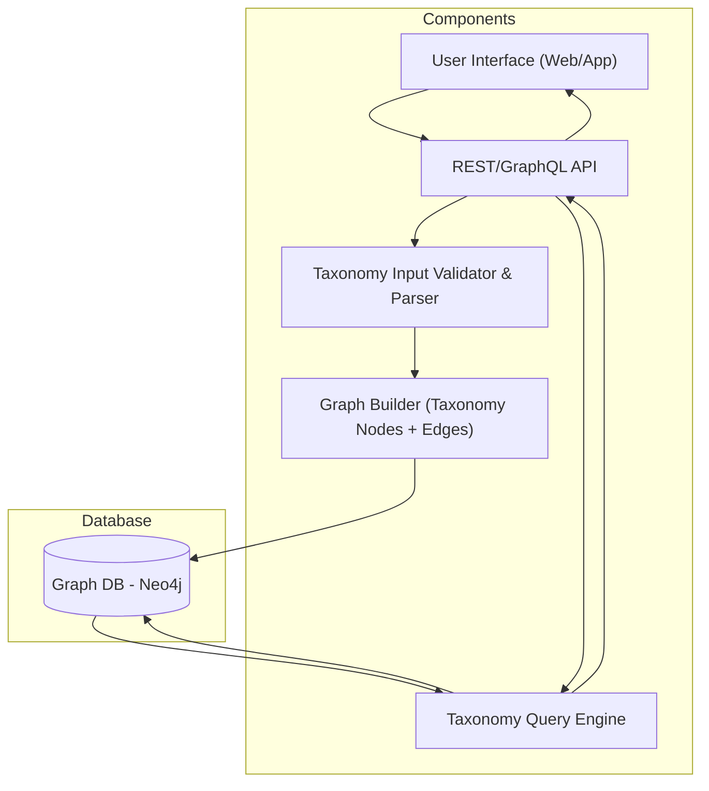
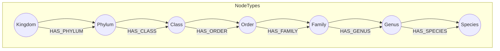

```mermaid
graph TD
    UI["User Interface (Web/App)"] --> API[REST/GraphQL API]
    API --> Parser["Taxonomy Input Validator & Parser"]
    Parser --> GraphBuilder["Graph Builder (Taxonomy Nodes + Edges)"]
    GraphBuilder --> DB[("Graph DB - Neo4j")]

    API --> QueryEngine[Taxonomy Query Engine]
    QueryEngine --> DB
    DB --> QueryEngine
    QueryEngine --> API
    API --> UI

    subgraph Components
        UI
        API
        Parser
        GraphBuilder
        QueryEngine
    end

    subgraph Database
        DB
    end
```



```mermaid
graph TD
    Kingdom --> Phylum
    Phylum --> Class
    Class --> Order
    Order --> Family
    Family --> Genus
    Genus --> Species

    subgraph NodeTypes
        Kingdom((Kingdom))
        Phylum((Phylum))
        Class((Class))
        Order((Order))
        Family((Family))
        Genus((Genus))
        Species((Species))
    end

    Kingdom -- "HAS_PHYLUM" --> Phylum
    Phylum -- "HAS_CLASS" --> Class
    Class -- "HAS_ORDER" --> Order
    Order -- "HAS_FAMILY" --> Family
    Family -- "HAS_GENUS" --> Genus
    Genus -- "HAS_SPECIES" --> Species

```


```c
MATCH path = (k:Kingdom)-[:HAS_PHYLUM*1..]->(s:Species {name: "Homo sapiens"})
RETURN path
```


