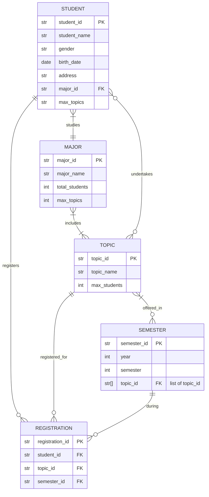
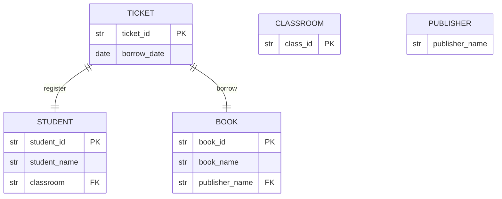

# ERD

```mermaid
erDiagram
    STUDENT {
        str student_id PK
        str student_name
        str gender
        date birth_date
        str address
        str major_id FK
        str max_topics
    }
    MAJOR {
        str major_id PK
        str major_name
        int total_students
        int max_topics 
    }
    TOPIC {
        str topic_id PK
        str topic_name
        int max_students
    }
    SEMESTER {
        str semester_id PK
        int year
        int semester
        str[] topic_id FK "list of topic_id"
    }
    REGISTRATION {
        str registration_id PK
        str student_id FK
        str topic_id FK
        str semester_id FK
    }
    STUDENT }|--|| MAJOR: studies
    MAJOR }|--|{ TOPIC: includes
    TOPIC }|--o{ SEMESTER: offered_in
    STUDENT }o--o{ TOPIC: undertakes
    STUDENT ||--o{ REGISTRATION: registers
    TOPIC ||--o{ REGISTRATION: registered_for
    SEMESTER ||--o{ REGISTRATION: during
```

```mermaid
erDiagram
    TICKET {
        str ticket_id PK
        date borrow_date
        
    }
    STUDENT {
        str student_id PK
        str student_name
        str classroom FK
    }
    BOOK {
        str book_id PK
        str book_name
        str publisher_name FK
    }
    CLASSROOM {
        str class_id PK
    }
    PUBLISHER {
        str publisher_name
    }
    TICKET ||--|| STUDENT: register
    TICKET ||--|| BOOK: borrow

```
