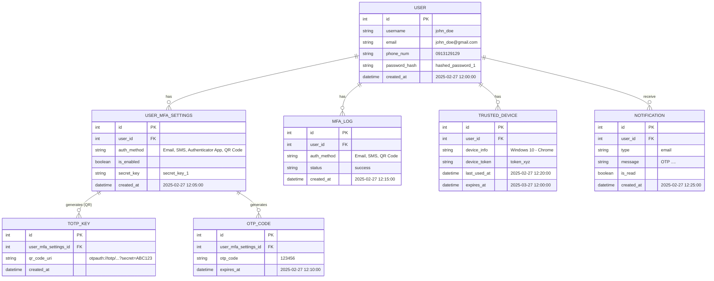

# ERD

```mermaid
erDiagram

    USER {
        int id PK
        string username "john_doe"
        string email "john_doe@gmail.com"
        string phone_num "0913129129"
        string password_hash "hashed_password_1"
        datetime created_at "2025-02-27 12:00:00"
    }

    USER_MFA_SETTINGS {
        int id PK
        int user_id FK
        string auth_method "Email, SMS, Authenticator App, QR Code"
        boolean is_enabled 
        string secret_key "secret_key_1"
        datetime created_at "2025-02-27 12:05:00"
    }

    TOTP_KEY {
        int id PK 
        int user_mfa_settings_id FK
        string qr_code_uri "otpauth://totp/...?secret=ABC123"
        datetime created_at
    }

    OTP_CODE {
        int id PK
        int user_mfa_settings_id FK
        string otp_code "123456"
        datetime expires_at "2025-02-27 12:10:00"
    }

    MFA_LOG {
        int id PK
        int user_id FK
        string auth_method "Email, SMS, QR Code"
        string status "success"
        datetime created_at "2025-02-27 12:15:00"
    }

    TRUSTED_DEVICE {
        int id PK
        int user_id FK
        string device_info "Windows 10 - Chrome"
        string device_token "token_xyz"
        datetime last_used_at "2025-02-27 12:20:00"
        datetime expires_at "2025-03-27 12:00:00"
    }

    NOTIFICATION {
        int id PK
        int user_id FK
        string type "email"
        string message "OTP ...."
        boolean is_read 
        datetime created_at "2025-02-27 12:25:00"
    }

    USER ||--o{ USER_MFA_SETTINGS : "has"
    USER ||--o{ MFA_LOG : "has"
    USER ||--o{ TRUSTED_DEVICE : "has"
    USER ||--o{ NOTIFICATION : "receive"
    USER_MFA_SETTINGS ||--o{ TOTP_KEY : "generates (QR)"
    USER_MFA_SETTINGS ||--o{ OTP_CODE : "generates"
```
