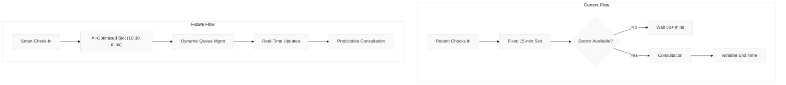

# 

```mermaid
%%{init: {'theme': 'base', 'themeVariables': { 'primaryColor': '#f8f9fa', 'edgeLabelBackground':'#fff'}}}%%
flowchart TD
    subgraph Current Flow
        A[Patient Checks In] --> B[Fixed 15-min Slot]
        B --> C{Doctor Available?}
        C -->|No| D[Wait 50+ mins]
        C -->|Yes| E[Consultation]
        E --> F[Variable End Time]
    end

    subgraph Future Flow
        G[Smart Check-In] --> H["AI-Optimized Slot (10-30 mins)"]
        H --> I[Dynamic Queue Mgmt]
        I --> J[Real-Time Updates]
        J --> K[Predictable Consultation]
    end
```